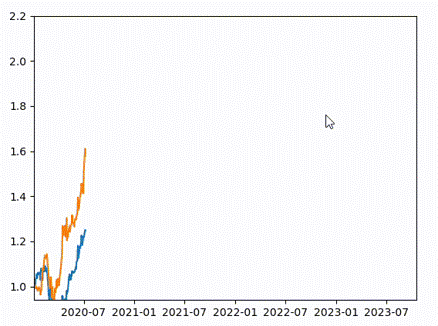
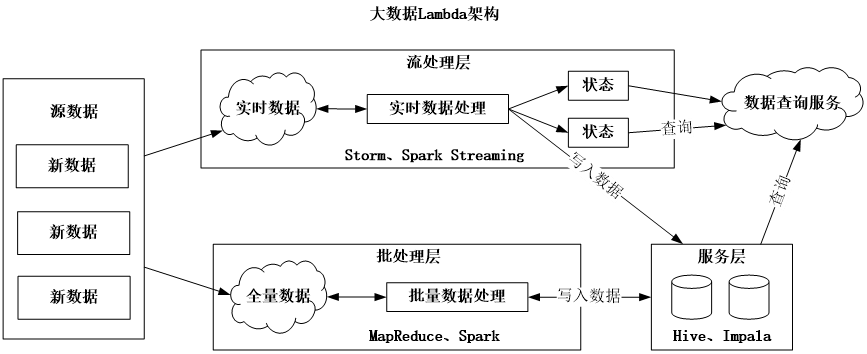
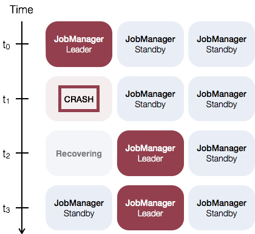
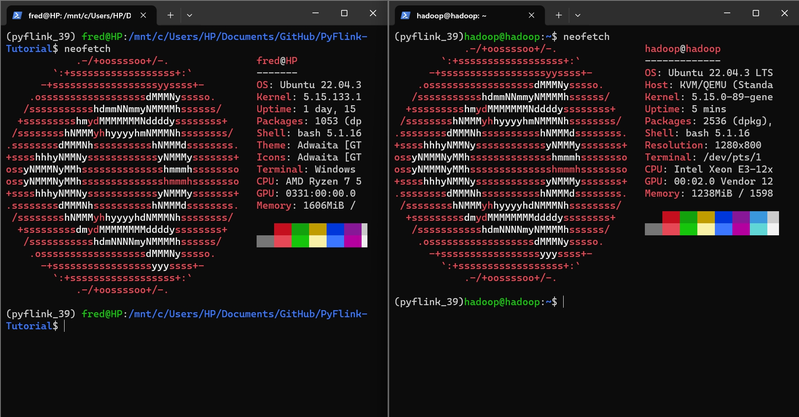

# 1 基于Python的流数据处理技术简介

## 1.0 版本说明

本文项目示例代码修改自官方[文档版本1.18](https://nightlies.apache.org/flink/flink-docs-release-1.18/docs/dev/python/datastream_tutorial/)。

## 1.1 课程定位和设计思路

这学期是我们这门课的第一次开课。
最初，我们想通过一个传统的编程语言Scala来实现流数据处理框架，并带领大家完成几个样例。
但后来我们发现这不太妥当。古人说得好，授人以鱼不如授人以渔。
如果我们只是把这个框架的使用方法告诉，那么这样的教学意义不大。
因此，我们决定向大家展示这种框架的来龙去脉，包括流数据处理的概念、目的等等。

此外，我们不再引入其他编程语言。一方面，这会干扰基础思想的理解，而我们注重的是思想而非技术。
另一方面，这些框架的发展速度很快。前几个版本可能支持Scala，但后几个版本可能就不支持了。

在学习 Apache Flink 这种大数据处理框架时，选择使用 Java 和 Python 而非 Scala 的理由有以下几点：

1. **稳定性**：如上文所述，大数据处理框架的发展速度很快，前几个版本可能支持 Scala，但后几个版本可能就不支持了。这种不确定性可能会对学习和使用带来困扰。相比之下，Java 和 Python 的支持更为稳定，更适合作为学习和使用的语言。

2. **易用性**：Python 以其简洁明了的语法和丰富的库被广泛应用于数据处理和分析领域，对于初学者来说更易上手。Java 作为一种静态类型语言，其严谨的类型系统和广泛的工业应用也使其成为学习 Flink 的好选择。

3. **避免干扰**：如上文所述，学习 Flink 的重点应该是理解流数据处理的基础思想，而非特定的技术或语言。引入 Scala 可能会因其复杂的语法和特性而干扰对基础思想的理解。相比之下，Java 和 Python 的语法更为直观和简洁，更有利于理解和实现流数据处理的基础思想。

4. **适应性**：随着编程语言的发展和编译环境的改进，某些编程技术的性能可能会有所变化。例如，有一段代码最初使用 for 循环来实现，但速度很慢。后来改成列表推导式，速度提升了。但是，随着编程语言的发展和编译环境的改进，for 循环有时可能比列表推导式更快。因此，选择一种更为稳定和广泛使用的语言，如 Java 或 Python，可能会更有利于适应这种变化。

总的来说，虽然 Scala 在某些方面可能有其优势，但在学习 Flink 的过程中，选择 Java 和 Python 可能会更为合适。

有些函数和方法在某些版本上是实现的，但在后续版本中可能会被修改。
在这种情况下，教大家记忆某个编程语言中的某个东西是否可修改，另一个是否不可修改，是没有意义的。

例如，有一段代码最初使用for循环来实现，但速度很慢。后来改成列表推导式，速度提升了。
但是，随着编程语言的发展和编译环境的改进，for循环有时可能比列表推导式更快。
因此，如果考试要求判断哪个更快，就像背古诗词一样，这样的考试就没有意义，也不好玩。

在我们这门课中，我们强调的是一个框架性的认知。
就是关于这个流数据的整个过程，从他的基本概念思路，再到产生发送接收和处理。
这个过程会有很多环节，需要大家动手去探索。有可能之前学过Linux操作系统，也学过虚拟机，也学过Python等等。
之前学的那些基础知识，在我们这一面这种层次的课程就要开始应用了。

本来，我已经为大家准备好了一个几乎完整的开发环境。虚拟机里面装好了所有的运行必备的组件以及编译器等等。
当然，我会提供这个虚拟机给大家。但还是希望能够带着大家从头开始独立构建。
这样能有机会了解每一步的操作，以便在以后的工作中能够独立完成。
而不只是通过考试，却没有真正掌握这些知识。

如果以后要从事这方面的相关工作，听了这一门课就够了吗？
那绝对不可能。因为任何一门大学的课程，一般都是一个概述。
通过这种课程，我们的目的是让了解这个领域的基础概念、基础思维和基础思路。
然后，需要进一步深入学习，可能去读研究生，专门从事学术领域的相关研究。
或者在具体的生产环境中去探索这方面的更深入的开发工作。

## 1.2 编程语言选择与代码难度

我们选择了Python编程语言，而没有选择Java和Scala。
首先是考虑到大家也都学过Python，上手的难度会比较低，对大家来说可能会比较友好。
另外是考虑依赖包的安装问题，如果选择Java，有的时候需要用maven去下载一些包，有时候会有网络问题；
然后还考虑到开发环境的搭建问题，Java的开发环境的配置相比Python也要复杂一点，工程的内容含量更高一些。
本来我们也考虑过引入Scala，后来教研室几位老师反复商量，没有这么做。
一方面是觉得引入一门全新的编程语言，对于大家来说还是有挑战。
另外一方面是，Scala本身虽然性能更好，但有很大可能要被一些开源项目所放弃。
因为针对它的专门维护可能需要一些额外的工作经历，但现在很多开源团队未必能有这么多的额外精力去继续维护它。
综上所述，我们选择了对大家都友好，又好上手好配置，不用太担心依赖包安装问题的Python。

| **编程语言** | **优势**                                                         | **劣势**                                                                           |
| ------------------ | ---------------------------------------------------------------------- | ---------------------------------------------------------------------------------------- |
| Java               | - 跨平台- 可扩展、向后兼容、稳定、生产就绪- 支持各种经过试验和测试的库 | - 冗长- 不支持"Read-Evaluate-Print-Loop（REPL）" 中文翻译是**读取-求值-输出-循环** |
| Scala              | - 面向对象和函数式编程特性- 高度可扩展                                 | - 学习曲线较陡峭                                                                         |
| Python             | - 易于学习、易于使用、易于阅读的语法- 有许多强大的库和框架             | - 解释性语言- 动态类型的语言                                                             |

以上是编程语言的选择。
对于代码这部分，大家不要担心。

首先在代码难度上，这堂课上涉及到的代码还是很友好的。
一方面，基本上所有的代码都有做注释，大家自己阅读的时候也能比较容易地理解。
另外一方面，授课的过程中，我们会拆解开来，一边演示一边讲解。
代码经验不是很丰富的同学，相信是能够跟得上这种详细的讲解的。
如果有学有余力的同学，也完全可以自己在深度上更进一步探索。

另外在代码规模上，本课程的代码一定不会很长很累人。
很多内容的复杂也就是思路和架构上的复杂性看上去吓人。
实际上基本概念落实到代码中可能就有几百行代码顶多了。
有的甚至就几十行代码就能完成。

在代码阅读和运行的过程中，可以使用一些AI助手：

1. **GitHub Copilot**：这是一个由GitHub和OpenAI共同开发的AI编程助手，可以在编写代码时提供代码建议。它可以帮助理解代码，生成新的代码，甚至修复代码中的错误。

2. **CodeGeex**：这是一个AI编程助手，可以在编写代码时提供代码补全建议。它支持多种编程语言，包括Python、Java、JavaScript等。

3. **通义灵码**：这是一个基于通义大模型的智能编码助手，可以根据代码文件和上下文，自动生成代码、单元测试、代码注释等，支持多种语言和框架。通义灵码还提供研发智能问答能力

这些AI助手可以帮助更好地理解代码，提高编程效率，减少错误。但请注意，它们只是工具，不能替代真正的编程理解和实践。

## 1.3 数据的基础认知

### 1.3.1 描述而非定义

首先，我们需要明确数据的定义。
在这里，我们所说的数据并不是指计算机处理器里面的指令和数据那种狭义场景下的数据。
而是一个更广泛意义上的数据。数据是可以被观测的，并且能够用数值记录下来的。
这是一个描述，而不是一个严格的定义。
虽然对数据的定义可能会有很多的争论，但我们做出的描述总是符合一定的经验的。

### 1.3.2 数据描述了人类个体、人类社会、外在世界

人的个体成长，作为一个自然过程，就伴随着各项数据的不断变化。身高、体重、体温等等。
小朋友，刚出生的时候可能只有几公斤，等长到了几岁了，可能就有十几公斤甚至几十公斤。
再长一些之后就有可能有上百公斤，比如我曾经就有100多公斤啊。
随着时间发展，人的宏观上身高、体重和各种生理指标可能都会发生变化。
而更细节上的体温、血相等等数据的异常波动可能预示了身体健康状况的问题。
有的人可能要由于身体健康的原因做长期的数据观测，检测血压、血糖、心率等等。


人的社会群体关系，也是一个充满数据的过程，可以用数据去描述。
亲属关系、身份编号、手机号码、就读学校、所学专业等等，这些信息也都在有意或者无意中被数据记录下来。
人类的复杂社会行为，比如商品供需关系、股票交易价格、货币汇率等等，也都得量化成数据。



人去看待外在的自然世界，也要借助数据。
外面天气的冷暖、风速的变化、降雨量的多少、地震的强度、建筑沉降的幅度、湖泊的面积、河水的流量、海水的含盐度等等。
人最早对外界事物的系统的描述，大概就是度量衡，在日常生活中用于计量物体长短、容积、轻重。
现在咱们也说衡量、度量、平衡等等，就这么来的。
甚至在微观领域上，对一个分子或者原子的描述，也要用到数据。


## 1.4 数据的形态划分这段话可以这样重构和润色：

所有的数据都在不断变化，而传统的观察方式只能截取到一个截面或者累积若干个截面，难以应对不断变化的现实世界。

成规模的数据有两种形态。一种是静态的数据，观测了一堆，不管这堆有多大，它是有固定的规模和有限的个数的，不会再进行改变。
另一种情况比较复杂，需要一直关注和更新。
这种情况有两种可能：
一种是这东西是无限的，一直在被生成出来，随时在变化，需要一直观测；
另一种可能是这东西规模太大，人力无法短时间内穷尽，即使是有限的，也需要持续观测和处理。这就是原生的流数据。

人的观测能力是有限的，因为人作为动物，我们的感官本身是受限的。
而且人记录的载体本身也存在物理上的上限。
因此，面对一些场景，人力无法全部认识整体，只能一点一点来，这个过程中也会导致数据持续产生。

静态的数据和流动的数据未必总是那么好区分。比如窗台边这有的是花岗岩，这些岩石形成的过程涉及到温度、压力和粘度等方面的变化。
这些变化有的是物理变化，有的是化学变化，这个过程有的可能要花费大概一百万年。
人现在认识这东西，都是测试平均的这么个成分上的，变成了一个静态的数据，但其实它的形成过程是一个动态的过程。

具体的个体，因为它自身状态可能会随着时间发生不断的变化，可能会产生流动的数据。
有限的群体，因为他们彼此之间的关系可能会发生不断的变化，也可能会产生流动的数据。
如果是一段有限的数据集合，但它在时间或者空间上可以有不同的排布和次序，也能变成流动的数据。

## 1.5 流数据的具体特征

专门提出来这个流数据的分析和处理，就是因为有一些场景下需要这类思路解决对应的问题。
而用传统的那种静态数据的处理思路，可能有一些解决不了的问题。
流数据处理技术是基于现实需求而产生。

事物是时刻不停的发展变化的，万事万物都非静态，运动是无处不在的。
自然界中咱们所观测到的一切数据实际上都是原生的流数据，因为这些东西往往存在着各种的变化。
只是变化的幅度可能会有差异，但这种变化是不停的。

流数据具有如下特征：

* 数据快速持续到达，潜在大小未知
* 数据来源众多，格式复杂，类型多样
* 数据量大，但不关注存储，经过处理后丢弃或归档存储
* 注重数据的整体价值，不过分关注个别数据
* 数据次序错乱，可能顺序颠倒或不完整，系统无法预测将处理的新到达数据元素的顺序

## 1.6 批计算与流计算

简单来说，对静态数据就凑够一批来进行批计算，对于流数据就随着数据流进行流计算。
这说的计算可以简单理解成就是加减乘除，甚至就是加法，当然还有逻辑运算。
再说复杂点呢，就有映射、筛选、键值选择等等，这些后面再细说。

批计算就是凑够一批，然后再算。
流计算就是一边流着，一边计算。
很直观的命名对不对？

传统的批计算能不能解决上面的一些场景呢？其实也能。
比如spark实际上就是用批计算，把流数据切成一小段一小段，然后每一段来进行处理。
反过来流计算能去应对传统的批计算场景吗？其实也能。
比如Flink也能做批计算，就是把批数据一条一条的发送过来，然后当成流数据来处理。
但这里边有一个关键的问题，就是用批计算去模拟云计算，一定要涉及到最小的批规模的问题。
要凑够一个最小的规模形成微批，这个最小可能也要几百毫秒。
而如果直接用流计算，可能响应时间就能缩到几毫秒。
在一些特定的商业场景，响应时间可能就很重要。
比如电子商务、电子交易，实时外卖派单等等。
当然也有的场景对于响应时间没有那么强的要求，反倒是对数据规模有要求。
比如机器学习，大语言模型的训练等等场景。
但综合来看，用流计算去模拟批计算是相对简单的。
而反过来用批计算去模拟流计算总是要面对着响应时间的障碍。

## 1.7 流计算的需求场景

流计算秉承一个基本理念，即数据的价值随着时间的流逝而降低，如用户点击、商品浏览、天气数据等等。
相比昨天的天气，更注重今天的天气。
当事件出现时就应该立即进行处理，而不是缓存起来进行批量处理。

自然环境中，数据的产生原本就是流式的。
无论是来自 Web 服务器的事件数据，证券交易所的交易数据，还是来自工厂车间机器上的传感器数据，其数据都是流式的。
当分析数据时，可以围绕 有界流（bounded）或 无界流（unbounded）两种模型来组织处理数据。
选择不同的模型，程序的执行和处理方式也都会不同。


批处理是有界数据流处理的范例。在这种模式下，可以选择在计算结果输出之前输入整个数据集，这也就意味着可以对整个数据集的数据进行排序、统计或汇总计算后再输出结果。

流处理正相反，其涉及无界数据流。至少理论上来说，它的数据输入永远不会结束，因此程序必须持续不断地对到达的数据进行处理。

为了及时处理流数据，就需要一个低延迟、可扩展、高可靠的处理引擎
对于一个流计算系统来说，它应达到如下需求：

* 高性能：处理大数据的基本要求，如每秒处理几十万条数据
* 海量式：支持TB级甚至是PB级的数据规模
* 实时性：保证较低的延迟时间，达到秒级别，甚至是毫秒级别
* 分布式：支持大数据的基本架构，必须能够平滑扩展
* 易用性：能够快速进行开发和部署
* 可靠性：能可靠地处理流数据

# 2 流计算的框架选择

## 2.1 传统架构的困境

传统的大数据系统一般使用所谓的Lambda架构，如下图所示。
其基本思路就是将数据进行分流：

* 一部分作为实时数据，使用流处理框架，比如Storm或者Spark Streaming来处理；
* 另一部分存入全量数据，使用MapReduce或者Spark来处理，当然现在主要是Spark。



上面这种传统的Lambda架构有啥问题呢？
首先就是架构复杂，技术栈多样，风险比较高。
一旦某一个环节出问题，就可能影响到很多方面。
由于整体架构复杂，又难以快速排查。
另外是运营和维护成本高。
每一条数据流程都需要有对应的单独的技术栈，可能就都需要对应的计算环境，就有可能带来资源浪费。
另外每一个单独的技术栈也需要单独的技术团队来维护，人力成本和管理成本都上升了。

## 2.2 流计算框架对比

针对上面的Lambda架构的复杂度问题，解决思路自然是统一用一个技术栈。

Spark的解决方案是使用Spark本体进行批计算，使用Spark Streaming进行流计算。
但实际上Spark Streaming是将流数据分成非常小的微批来处理，因此难以达到毫秒级的响应。
对Spark而言，它会使用一系列连续的微小批处理来模拟流处理，也就是说，它会在特定的时间间隔内发起一次计算，而不是每条数据都触发计算，这就相当于把无界数据集切分为多个小量的有界数据集。

Flink的解决方案是全面流计算，将批数据也都当作有限流来处理。
这样一来确实很好地降低了整体架构的复杂度。但是在机器学习等场景下还不如Spark好用。
对Flink而言，它把有界数据集看成无界数据集的一个子集，因此，将批处理与流处理混合到同一套引擎当中，用户使用Flink引擎能够同时实现批处理与流处理任务。

除此以外，关于流计算，还有传统的老牌实力派框架Storm。
Storm的性能也可以，能做到毫秒级延迟，但问题是吞吐量不够高，而且数据一致性上有点问题。

## 2.3 数据一致性

数据一致性是个什么概念呢？

当在分布式系统中引入状态时，自然也引入了一致性问题。根据正确性级别的不同，一致性可以分为如下三种形式：

* 最多一次（at-most-once）可能会少：尽可能正确，但不保证一定正确。也就是说，当故障发生时，什么都不做，既不恢复丢失状态，也不重播丢失的数据。这就意味着，在系统发生故障以后，聚合结果可能会出错。
* 至少一次（at-least-once）可能会多：在系统发生故障以后，聚合计算不会漏掉故障恢复之前窗口内的事件，但可能会重复计算某些事件，这通常用于实时性较高但准确性要求不高的场合。该模式意味着系统将以一种更加简单的方式来对算子的状态进行快照处理，系统崩溃后恢复时，算子的状态中有一些记录可能会被重放多次。例如，失败后恢复时，统计值将等于或者大于流中元素的真实值。
* 精确一次（exactly-once）个数精准：在系统发生故障后，聚合结果与假定没有发生故障情况时一致。该模式意味着系统在进行恢复时，每条记录将在算子状态中只被重播一次。例如在一段数据流中，不管该系统崩溃或者重启了多少次，该统计结果将总是跟流中的元素的真实个数一致。这种语义加大了高吞吐和低延迟的实现难度。与“至少一次”模式相比，“精确一次”模式整体的处理速度会相对比较慢，因为在开启“精确一次”模式后，为了保证一致性，就会开启数据对齐，从而会影响系统的一些性能。

| **数据一致性**   | **基本含义**             | **出错应对**               |
| ---------------------- | ------------------------------ | -------------------------------- |
| 最多一次 at most once  | 一条数据在数据流中最多出现一次 | 出错即抛弃                       |
| 至少一次 at least once | 一条数据在数据流中最少出现一次 | 一直补上去，多了也不管           |
| 精确一次 exactly once  | 一条数据在数据流中只出现一次   | 出错了也要补上去，且保证只有一个 |

简单来说，数据一致性可以分为如下三种形式：

* 最多一次（at-most-once）可能会少，当故障发生时，什么都不做，既不恢复丢失状态，也不重播丢失的数据。
* 至少一次（at-least-once）可能会多，不会漏掉故障恢复之前窗口内的事件，但可能会重复计算某些事件，适合实时性较高但准确性要求不高的场合。
* 精确一次（exactly-once）个数精准，每个事件用且仅用一次，适合对数据准确性要求较高的场合。

单独来看看流处理框架，曾经的主流是Storm，但随着技术发展，现在的舞台上主角已经是Spark和Flink了。
Spark Streaming由于微批（Mini Batch）设计，难以实现毫秒级的响应，在对实时性要求比较高的场景下不太适用。
不过由于Spark有多年积累，机器学习领域的应用很广泛。

| **框架**  | **数据一致性** | **吞吐量** | **延迟** | **适应场景**                   |
| --------------- | -------------------- | ---------------- | -------------- | ------------------------------------ |
| Storm           | - 至少一次           | - 低             | - 毫秒         | - 稍低吞吐量场景                     |
| Spark Streaming | - 精确一次           | - 高             | - 100毫秒      | - 响应时间不敏感场景，如机器学习场景 |
| Flink           | - 精确一次           | - 高             | - 毫秒         | - 响应时间敏感场景                   |

如果要真正实现流批一体处理，Flink更适合高吞吐量的快速响应场景。

## 2.4 Flink 的发展历史

Flink是Apache软件基金会的一个顶级项目，是为分布式、高性能、随时可用以及准确的流处理应用程序打造的开源流处理框架，并且可以同时支持实时计算和批量计算。

Flink起源于Stratosphere 项目，该项目是在2010年到2014年间由柏林工业大学Technical University of Berlin、柏林洪堡大学 Humboldt University of Berlin和哈索普拉特纳研究所Hasso Plattner Institute联合开展的。

Flink具有十分强大的功能，可以支持不同类型的应用程序。Flink的主要特性包括：批流一体化、精密的状态管理、事件时间支持以及精确一次的状态一致性保障等。
Flink 不仅可以运行在包括 YARN、Kubernetes等在内的多种资源管理框架上，还支持在裸机集群上独立部署。
在启用高可用选项的情况下，Flink不存在单点失效问题。
Flink 已经可以扩展到数千核心，其状态可以达到 TB 级别，且仍能保持高吞吐、低延迟的特性。
世界各地有很多要求严苛的流处理应用都运行在 Flink 之上。

在国外，优步、网飞、微软和亚马逊等已经开始使用Flink。
在国内，包括阿里巴巴、美团、滴滴等在内的知名互联网企业，都已经开始大规模使用Flink作为企业的分布式大数据处理引擎。

在阿里巴巴，基于Flink搭建的平台于2016年正式上线，并从阿里巴巴的搜索和推荐这两大场景开始实现。
阿里巴巴很多业务都采用了基于Flink搭建的实时计算平台，内部积累起来的状态数据，已经达到PB级别规模。
每天在平台上处理的数据量已经超过万亿条，在峰值期间可以承担每秒超过4.72亿次的访问，最典型的应用场景是双11。

2014年4月，Stratosphere代码被贡献给Apache软件基金会，成为Apache软件基金会孵化器项目。
2014年12月，Flink项目成为Apache软件基金会顶级项目。

## 2.5 Flink 的基本概念

### 2.5.1 Flink 的抽象层次

Flink 设计了四个抽象层次，从最基础到最高层依次是状态数据流、数据流和数据集核心接口、数据表接口、高级交互式查询语言接口。


Flink API 最底层的抽象为有状态实时流处理。

Flink API 第二层抽象是核心接口（Core APIs），也是大家一般要用到的。
其中对咱们课程来说，最重要的就是数据流接口（DataStream API） 应用于有界/无界数据流场景。
这一层 API 中处理的数据类型在每种编程语言中都有其对应的类。
目前 PyFlink 官方样例没有看到提及 DataSet API（数据集接口）。

Flink API 第三层抽象是数据表接口（Table API）。
数据表接口（Table API） 是以表（Table）为中心的。
流式数据场景下，可以表示一张正在动态改变的表。
数据表（Table）拥有模式（schema），发音 “skee-muh” 或者“skee-mah”。
类似于关系型数据库中的 schema，定义了组织和结构，包含了表、列、数据类型、视图、存储过程、关系等。
数据表接口（Table API）也提供了类似于关系模型中的操作，比如 select、project、join、group-by 和 aggregate 等。

在Flink中，数据表（Table）和数据流（DataStream）可切换，Flink 允许用户在编写应用程序时混合使用。

Flink API 最顶层抽象是 SQL，其程序实现都是 SQL 查询表达式。
SQL 查询语句可以在 Table API 中定义的表上执行。

### 2.5.2 Flink 的架构设计

Flink 可以运行在本地，也可以运行于集群之中。
在集群上，Flink 有两类进程角色：至少一个工作管理节点（JobManager）和多个工作节点（Worker）或者也叫任务管理节点（TaskManager）。

工作管理节点（JobManager）负责调度和资源管理，内部有三个不同组件：

* 资源管理器（ResourceManager）
* 作业分发器（Dispatcher）
* 任务管理员（JobMaster）


增加工作管理节点，可以提高Flink集群系统的可用性。
但多个工作管理节点之中，只有一个一直是首要节点（leader），其他的是待命状态（standby）
下图展示的是一个三个工作管理节点的集群，其中首要节点发生故障后，任务进行了移交。



工作节点（Worker）/任务管理节点（TaskManager）执行作业流的人物（task），缓存和交换数据流。

* 一个工作节点中资源调度的最小单位是任务槽（task slot）；
* 一个工作节点并发处理任务的数量就是任务槽的总量；
* 每一个任务槽可以执行多个算子。


客户端可以是单独的Java/Python程序，去访问已有的Flink集群。
也可以在Flink环境下以命令方式运行。

客户端访问Flink 集群有两种模式：

* 分离模式下，客户端可以与集群断开连接；
* 附加模式下，客户端可以与集群保持连接接收进程报告。

### 2.5.3 Flink 的数据流

在 Flink 中，应用程序由用户自定义算子转换而来的数据流（dataflows） 所组成。
这些数据流形成了有向图，以一个或多个源（source）开始，并以一个或多个汇（sink）结束。
在这个过程中，程序会对数据流进行各种变换（transformation），这些变换往往是由一个或者多个算子（operator）组成。


数据流的来源可以是文件、数据库、消息队列或者实时数据，比如来自Kafka，也可以是有界的历史数据。
数据流被Flink进行变换操作后得到的结果可以是数据汇，也可以继续是新的数据流。
新的数据流就可以发送到其他的程序过程中。


Flink 程序本质上是分布式并行程序。
Flink 程序执行期间，一个流有一个或多个流分区（Stream Partition）；
每个算子有一个或多个算子子任务（Operator Subtask）；
每个子任务彼此独立，并在不同的线程、在不同的计算机或容器中运行。
算子的子任务的个数就是其对应算子的并行度。
在同一程序中，不同算子也可能具有不同的并行度。


Flink 可以将任何可序列化的对象转化为流，自带的序列化器有：

* 基本类型，String、Long、Integer、Boolean、Array
* 复合类型：Tuples、POJOs、Scala case classes

将上面的各种数据转换成数据流之后，还要构建执行环境。
每个 Flink 应用都需要有执行环境，在大多数示例代码中为 env。
流式应用需要用到 StreamExecutionEnvironment。

### 2.5.4 Flink 的数据表

Flink提供了两种关系型接口，一种是数据表接口（Table API），另一种是Flink SQL。前者是用于Java/Python的查询接口，可以直观地对数据进行选取过滤等操作运算，后者是一种标准SQL接口。

要注意，Flink 的数据表（Table）并不是传统意义的表，而是可以以不断变化修改的形态统一处理流和批的通用数据接口。

数据表的来源可以是数据流，也可以是具体的文件，比如JSON文件或者CSV文件等等。
在后续的代码环节，这些场景我们都会遇到。

下面是 Flink 中数据表内容所支持的一些变量类型

| **变量类型** | **简单解释**                             |
| ------------------ | ---------------------------------------------- |
| CHAR               |                                                |
| VARCHAR            |                                                |
| STRING             |                                                |
| BOOLEAN            |                                                |
| BINARY             |                                                |
| VARBINARY          |                                                |
| BYTES              |                                                |
| DECIMAL            | Supports fixed precision and scale.            |
| TINYINT            |                                                |
| SMALLINT           |                                                |
| INTEGER            |                                                |
| BIGINT             |                                                |
| FLOAT              |                                                |
| DOUBLE             |                                                |
| DATE               |                                                |
| TIME               | Supports only a precision of 0.                |
| TIMESTAMP          |                                                |
| TIMESTAMP_LTZ      |                                                |
| INTERVAL           | Supports only interval of MONTH and SECOND(3). |
| ARRAY              |                                                |
| MULTISET           |                                                |
| MAP                |                                                |
| ROW                |                                                |
| RAW                |                                                |
| Structured types   | Only exposed in user-defined functions yet.    |

下面是这些变量类型的翻译，有的数据类型比如RAW我都没在计算机里面遇到过：

| **变量类型** | **翻译**                          |
| ------------------ | --------------------------------------- |
| CHAR               | 字符串                                  |
| VARCHAR            | 可变长度字符串                          |
| STRING             | 字符串                                  |
| BOOLEAN            | 布尔值                                  |
| BINARY             | 二进制数据                              |
| VARBINARY          | 可变长度二进制数据                      |
| BYTES              | 字节                                    |
| DECIMAL            | 十进制定点数                            |
| TINYINT            | 微整型                                  |
| SMALLINT           | 小整型                                  |
| INTEGER            | 整型                                    |
| BIGINT             | 大整型                                  |
| FLOAT              | 浮点数                                  |
| DOUBLE             | 双精度浮点数                            |
| DATE               | 日期                                    |
| TIME               | 无时区意义的时间                        |
| TIMESTAMP          | 时间戳                                  |
| TIMESTAMP_LTZ      | 本地时间戳，这个LTZ就是 local time zone |
| INTERVAL           | 仅支持月和秒的间隔                      |
| ARRAY              | 数组                                    |
| MULTISET           | 多集合                                  |
| MAP                | 映射                                    |
| ROW                | 行                                      |
| RAW                | 原始数据                                |
| Structured types   | 结构化类型, 仅在用户定义的函数中公开。  |

# 3 环境搭建

工欲善其事必先利其器，工具的选择是第一步。

## 3.1 操作系统安装

生产环境中，大规模集群普遍使用的是GNU/Linux操作系统，当然也有一些追求稳定性的场景可能会选用FreeBSD或者OpenBSD之类的BSD系统。
对于初入相关领域的同学，可以选择从Debian系的发行版入手，如果以后对运维方面感兴趣，可以再自行探索RedHat系的系统发行版。

本次课程选用的是 Ubuntu 22.04.3 LTS AMD64 版本操作系统，可以从[清华大学TUNA的下载地址](https://mirrors.tuna.tsinghua.edu.cn/ubuntu-releases/jammy/ubuntu-22.04.3-desktop-amd64.iso)来获取ISO文件。

操作系统的安装有两种方式，物理机安装，或者虚拟机安装。

物理机安装就是将操作系统安装到真实的物理实体的一天机器上。
这样的好处是性能会充分发挥，与真实环境非常接近。
适合有单独的一台机器可以用于安装的场景。
但单独使用Linux系统可能要面对一些软件生态的挑战，因此不适合对Windows或者macOS软件生态有重度依赖的场景。

虚拟机安装有两种方式。首先，对于Windows10/11的用户来说，可以试试用 WSL 或者 WSL2。
WSL 是 Windows Subsystem for Linux 的缩写，意思为适用于 Linux 的 Windows 子系统。
WSL2 是 WSL1 的升级版本，有更方便的文件访问权限。
使用 WSL1/2 实际上是基于 Windows 10/11 内置的 Hyper-V 虚拟机，优势在于性能较好，且方便与宿主系统交互。
缺点在于网络配置无法单独实现，通常只能使用宿主系统的网络地址转发。
因此适合注重性能但不需要复杂集群网络结构的单节点场景。

最常见的虚拟机安装方式，是基于 VMware Player 或者 VirtualBox 之类的桌面虚拟化软件来安装。
这些桌面虚拟化软件安装虚拟机后，虚拟机的打开和运行就像是宿主机上的一个应用程序一样，非常方便。
这种场景可能最适合大家初学时期的日常使用。
VMware Player 的性能似乎更好些，但似乎仅在 Linux 宿主的版本中提供了进阶的网络配置功能，Windows上没有提供。
VirtualBox 的性能表现稍差，但有非常全面的配置选项，尤其是网络自定义功能很方便，适合虚拟组网。

还有一种虚拟机安装方式，是先安装专门用于虚拟化的平台系统，比如PVE（Proxmox Virtual Environment）或者 VMware ESXi 等。
然后在安装好的虚拟化平台上来安装多个虚拟机系统。
这种安装方式被用于很多企业的开发和生产环境中，与容器和资源管理调度等相结合，可以实现服务的冗余备份和无感知迁移。

还有一种更为复杂一点的玩法，是使用嵌套虚拟化（nested virtualization），这需要处理器等硬件平台支持。
对于Intel处理器，需要VT-x支持；对于AMD处理器，需要AMD-V支持。当然，最近几年的主流处理器可能都支持了。
在硬件支持的前提下，可以用桌面虚拟化的方式借助 VMware Player 或者 VirtualBox，在其中安装 PVE 或者 ESXi 之类的虚拟化平台，然后再在平台上安装需要的虚拟机。
当然，嵌套虚拟化可能要面对网络设置和存储资源分配等多方面较为复杂的配置问题。

综合考虑，本次课程选择使用 [VirtualBox](https://www.virtualbox.org/wiki/Downloads) 这一虚拟机软件，在其中运行 [Ubuntu 22.04.3 操作系统](https://mirrors.tuna.tsinghua.edu.cn/ubuntu-releases/jammy/ubuntu-22.04.3-desktop-amd64.iso)。

在安装的过程中，大家都尽量使用默认配置即可，另外需要注意的是，请尽量将用户名和密码暂且都设置为 hadoop，以保持与分布式课程的设置一致性。

大家可以选择自行安装虚拟机系统，也可以直接使用本课程提供的虚拟镜像。
虚拟机镜像中本课程项目的存储路径为 `/home/hadoop/Desktop/PyFlink-Tutorial`。



## 3.2 依赖组件安装

安装好操作系统之后，还需要安装一些基础组件。
编程语言方面，本课程使用的是Python编程语言。
其他组件主要有两个，一个适用于流数据传输与接收的 Apache Kafka，另一个是用于流数据的处理与计算的 Apache Flink。

考虑到授课时长和复杂度等方面的因素，本次课程不再单独讲授 Apache Kafka 的安装，也不使用单独运行的 Kafka，而是使用 docker 镜像来运行一个本地实例。
在 Python 下使用的 PyFlink 需要本地安装有 Apache Flink，只需要采取单节点模式即可。

### 3.2.1 Anaconda3 安装

考虑到版本管理和环境控制等方面的便利性，选择安装 Anaconda3。
首先从TUNA下载Anaconda3安装包。
这里使用的是特定的版本，目的是为了保证后面组件的兼容性。

```Bash
wget https://mirrors.tuna.tsinghua.edu.cn/anaconda/archive/Anaconda3-2023.09-0-Linux-x86_64.sh
sh Anaconda3-2023.09-0-Linux-x86_64.sh
```

安装过程中，请使用默认设置。
应该安装在 `~/anaconda3`。

注意不要下载成其他操作系统或者其他处理器架构的版本。

### 3.2.2 Python 3.9 安装

Anaconda3 最新版默认安装的可能已经是 Python 3.11 甚至 Python 3.12。
而我们所用的 PyFlink 还是适合运行在 Python 3.9 这个版本上。

这里要强调的是，生产环境中，对于很多组件不能够盲目追求最新，而环境的稳定性才是最重要的。

通过 conda 安装 Python 3.9 将变得简单可靠。

```Bash
conda create -n pyflink_39 python=3.9
conda activate pyflink_39
```

### 3.2.3 Apache-Flink 安装

先去[Apache 官网](https://dlcdn.apache.org/flink/)下载安装 flink，这里以 1.18.0 为例：

```Bash
wget https://dlcdn.apache.org/flink/flink-1.18.0/flink-1.18.0-bin-scala_2.12.tgz
sudo tar -zxvf flink-1.18.0-bin-scala_2.12.tgz  -C /usr/local   
```

修改目录名称，并设置权限，命令如下：

```Bash
cd /usr/local
sudo mv / flink-1.18.0 ./flink #这里是因为我这里下的是这个版本，读者需要酌情调整
sudo chown -R hadoop:hadoop ./flink ##这里是因为我这里虚拟机的用户名是这个，读者需要酌情调整
```

Flink解压缩并且设置好权限后，直接就可以在本地模式运行，不需要修改任何配置。
如果要做调整，可以编辑 `“/usr/local/flink/conf/flink-conf.yam`这个文件。
比如其中的 `env.java.home`参就可以设置为本地Java的绝对路径
不过一般不需要手动修改什么配置。

不过，需要注意的是，Flink现在需要的是Java11，所以需要用下列命令手动安装一下：

```Bash
sudo apt install openjdk-11-jdk -y
```

接下来还需要修接下来还需要修改配置文件，添加环境变量：

```Bash
nano ~/.bashrc
```

文件中添加如下内容：

```Bash
export FLINK_HOME=/usr/local/flink
export PATH=$FLINK_HOME/bin:$PATH
```

保存并退出.bashrc文件，然后执行如下命令让配置文件生效：

```Bash
source ~/.bashrc
```

### 3.2.4 Kafka-Python 和 PyFlink 以及依赖包

然后使用 pip 安装 Kafka-python、apache-flink 以及依赖包。

```Bash
pip install kafka-python 
pip install apache-flink
pip install chardet pandas numpy scipy simpy 
pip install matplotlib cython sympy xlrd pyopengl BeautifulSoup4 pyqt6 scikit-learn requests tensorflow torch keras tqdm gym DRL
```

# 4 流数据的生成与传输

## 4.1 流数据的来源

网站数据采集，用户行为产生，购物网站、社交网站。
传感器采集，物联网传输，科研观测、探测器。
人类在互联网上的几乎一切活动，都可以看作是流数据的生成过程。

生成了流数据之后，如何使之流动，就成了问题。
具体来说，要对其进行传输、存储、接收。

## 4.2 Apache Kafka 基础

本次课程我们使用的是 [Apache Kafka](https://kafka.apache.org/intro)。
Kafka 是一个流数据传输平台，腾讯、字节跳动、Cisco、Oracle、Paypal、Spotify等等厂商都在使用。
Kafka 主要具有三个主要的功能：

* 写入（write）和读取（read）数据流；
* 根据需求设计存储（store）数据流；
* 对数据流进行处理（process）。

简单来说，一个实际运行的 Kafka 分布式系统是基于 TCP/IP 网络协议的集群。
具体又分为服务器（Servers）和客户端（Clients）两种。
服务端可以是一个，也可以是多台，构成存储层的服务器称为代理（Broker）。
客户端允许用户编写分布式应用或者微服务，可以对数据流进行并行的读写和处理。

Kafka 支持很多种编程语言，比如 Java、Scala、Go、Python等。
另外，Kafka 可以接入其他系统，或者将数据传输给其他系统。

## 4.3 Kafka 的构成

Kafka 的最小元素是事件（Event），一个事件一般有三个数据项目：

* 事件键名（Event Key）："张三"
* 事件键值（Event Value）："支付话费50元"
* 事件时间戳（Event TimeStamp）："2023年12月1日12点48分"
  当然，实际上还可以添加很多额外的数据。

向整个 Kafka 系统写入事件流的，称为生产者（Producer），订阅（读取并处理）事件流的，称为消费者（Consumer）。
有生产者写入事件，实际上就是生成流数据；也有消费者读取事件，实际上也就是使用流数据。

可 Kafka 是一个分布式的并行系统，能一下子收发处理好多个数据流，那数据流之间怎么来区分呢？
这就引入了下一个概念，就是主题（Topic）。
主题就像是磁盘路径下的文件夹，关注同一个数据流的生产者和消费者只要指定好同样的主题，就不会和其他的数据流有混淆了。

如果情况复杂一点，一个主题下有多个生产者，该怎么来保证消费者读取数据的时候不混乱呢？
Kafka 给主题引入了分区的概念，具有相同事件关键字的事件会被写入相同的主题分区，保证特定主题分区的任何用户都能以与写入事件完全相同的顺序读取该分区的事件。


## 4.4 Kafka 容器运行

本次课程选择使用 Docker 镜像方式来运行 Kafka。
可以首先找到一个有权限写入和存储的路径，创建名为 `docker-compose.yml`的文件，内容如下：

```YML
version: '3'
services:
  zookeeper:
    image: 'bitnami/zookeeper:latest'
    environment:
      - ALLOW_ANONYMOUS_LOGIN=yes
  kafka:
    image: 'bitnami/kafka:latest'
    ports:
      - '9092:9092'
    environment:
      - KAFKA_ADVERTISED_HOST_NAME=localhost
      - KAFKA_ZOOKEEPER_CONNECT=zookeeper:2181
      - KAFKA_ADVERTISED_LISTENERS=PLAINTEXT://localhost:9092
      - KAFKA_LISTENERS=PLAINTEXT://0.0.0.0:9092
      - KAFKA_CREATE_TOPICS=test:1:1
      - ALLOW_PLAINTEXT_LISTENER=yes
    depends_on:
      - zookeeper
```

如果有需要，可以使用以下命令停止并删除当前所有的 Docker 容器：

```Bash
docker stop $(docker ps -a -q) && docker rm $(docker ps -a -q)
#这条命令会先停止所有正在运行的 Docker 容器，然后删除所有 Docker 容器。
```

如果需要删除所有 Docker 镜像，可以使用以下命令：

```Bash
docker rmi $(docker images -q)
# 请注意，这些命令会删除所有 Docker 容器和镜像，包括正在运行的容器和镜像
```

将上面名为 `docker-compose.yml`的文件保存好后，可以在该文件所在路径下运行下列命令启动容器：

```Bash
sudo docker-compose up -d
```

然后终端中可能会有如下提示：

```Bash
Starting pyflink-tutorial_zookeeper_1 ... done
Starting pyflink-tutorial_kafka_1     ... done
```

如果后续运行 Python 代码推送数据到 Kafka 的时候遇到报错，可以检查容器是否正常运行，使用如下命令：

```Bash
sudo docker ps
```

正常情况下应该会有一个 Kafka 容器和一个 ZooKeeper 容器运行，如下所示：

```Bash
CONTAINER ID   IMAGE                      COMMAND                  CREATED      STATUS              PORTS                                       NAMES
6dea7ce04807   bitnami/kafka:latest       "/opt/bitnami/script…"   6 days ago   Up 6 seconds        0.0.0.0:9092->9092/tcp, :::9092->9092/tcp   pyflink-tutorial_kafka_1
88d0c914f65d   bitnami/zookeeper:latest   "/opt/bitnami/script…"   6 days ago   Up About a minute   2181/tcp, 2888/tcp, 3888/tcp, 8080/tcp      pyflink-tutorial_zookeeper_1
```

如果缺少某一个，就重新运行上面的命令来启动容器即可：

```Bash
sudo docker-compose up -d
```

# 5 Kafka 环境生成、传输、展示文本数据流

## 5.1 基于文本生成数据流

接下来我们使用 Python 创建一个生产者，读取本地的一个“hamlet.txt”文本文件，发送给运行在本地容器中的 Kafka。

使用以下代码将“TXT”文件转换为“Kafka Stream”。

```Python
#以下代码使用kafka-python模块将数据发送到本地Kafka集群。
#此代码打开一个名为“hamlet.txt”的文本文件，并将其内容作为流发送到指定的 Kafka 主题“hamlet”：

from kafka import KafkaProducer
import time
import os

# 定义一个函数，用于将文件发送到Kafka，参数为文件路径、主题和Kafka服务器地址
def send_file_to_kafka(file_path: str, topic: str, bootstrap_servers: str):
    # 创建一个KafkaProducer实例，用于发送消息
    producer = KafkaProducer(bootstrap_servers=bootstrap_servers)
    # 获取文件大小
    file_size = os.path.getsize(file_path)
    # 循环发送文件
    while True:
        # 打开文件，以二进制方式读取
        with open(file_path, "rb") as f:
            # 循环读取文件
            while True:
                # 读取1024字节的数据
                data = f.read(1024)
                # 如果读取完毕，则跳出循环
                if not data:
                    break
                # 将数据发送到Kafka，并打印发送的进度
                producer.send(topic, data)
                # 计算已发送的数据量
                percent_sent = (f.tell() / file_size) * 100
                bytes_sent = len(data)
                print(f"Sent {bytes_sent} bytes {topic} {percent_sent:.2f}% sent")
                # 每3秒打印一次发送进度
                time.sleep(3)
        # 询问用户是否继续发送文件
        user_input = input("Press 'c' to continue sending the file or 'q' to quit: ")
        # 如果用户输入q，则退出循环
        if user_input == "q":
            break

# 调用函数，将hamlet.txt文件发送到Kafka，主题为hamlet，Kafka服务器地址为localhost:9092
send_file_to_kafka("./hamlet.txt",  "hamlet", "localhost:9092")

# 在此代码中，send_file_to_kafka 函数接受三个参数：file_path、topic 和 bootstrap_servers。
# file_path是本地文件的路径，topic是数据要发送到的Kafka主题，bootstrap_servers是Kafka集群的地址。
# 该函数使用with语句打开文件，读取其内容，并将它们作为流数据发送到指定的Kafka主题。
# 发送过程中，打印出发送进度，并使用time.sleep方法暂停3秒来控制发送速率。
```

运行起来后在终端中的效果大概如下所示：

```Bash
Sent 1024 bytes hamlet 0.57% sent
Sent 1024 bytes hamlet 1.13% sent
Sent 1024 bytes hamlet 1.70% sent
Sent 1024 bytes hamlet 2.27% sent
Sent 1024 bytes hamlet 2.83% sent
```

## 5.2 使用 Kafka-Python 接收文本数据流

使用以下代码将数据流中主题为hamlet的文本数据展示出来。

```Python
from kafka import KafkaConsumer

# 创建一个KafkaConsumer对象，用于从Kafka主题中读取消息
consumer = KafkaConsumer(
    # 指定要读取的消息主题
    "hamlet",
    # 指定Kafka服务器的地址和端口
    bootstrap_servers=["localhost:9092"],
    # 指定消费偏移量，可以是earliest、latest或指定specific offset
    auto_offset_reset="earliest",
    # 指定是否在消费时自动提交偏移量
    enable_auto_commit=True,
    # 指定消费组名
    group_id="my-group",
    # 指定消息反序列化函数，将字节转换为字符串
    value_deserializer=lambda x: x.decode("utf-8")
)

# 循环读取Kafka消息，并打印消息长度和消息内容
for message in consumer:
    print(f"Received {len(message.value)} bytes from Kafka topic {message.topic}")
    print(f"{message.value}")


# 在上面的代码中，我们使用`KafkaConsumer`类来创建一个消费者对象。
# 我们将 `hamlet` 作为主题名称传递给构造函数。
# 我们还传递 `localhost:9092` 作为引导服务器的地址。
# 我们使用 `value_deserializer` 参数来解码从 Kafka 主题收到的消息。
# 我们使用 `for` 循环来迭代消费者对象，并使用 `print` 函数来打印消息的内容。
```

运行起来后在终端中的效果大概如下所示：

```Bash
start reading data from kafka
10>
The Tragedy of Hamlet, Prince of Denmark
Shakespeare homepage | Hamlet | Entire play
ACT I

SCENE I. Elsinore. A platform before the castle.

FRANCISCO at his post. Enter to him BERNARDO
BERNARDO
Who's there?
FRANCISCO
Nay, answer me: stand, and unfold yourself.
BERNARDO
Long live the king!
FRANCISCO
```

## 5.3 简单的词频统计

使用以下代码，对刚生成的这个 hamlet 数据流的逐行词频进行统计：

```Python
import argparse
import io
import json
import logging
import os
import pandas as pd
import re
from collections import Counter
from io import StringIO
from pyflink.common import SimpleStringSchema, Time
from pyflink.datastream.connectors.kafka import FlinkKafkaConsumer
from pyflink.datastream import StreamExecutionEnvironment
from pyflink.table import (DataTypes, EnvironmentSettings, FormatDescriptor,
                           Schema, StreamTableEnvironment, TableDescriptor,
                           TableEnvironment, udf)
from pyflink.table.expressions import col, lit

# 定义一个函数，用于移除文本中的标点符号
def remove_punctuation(text):
    # 使用正则表达式移除文本中的标点符号
    return re.sub(r'[^\w\s]','',text)

# 定义一个函数，用于计算文本中字节数
def count_bytes(text):
    # 返回文本中字节数
    return len(text.encode('utf-8'))

# 定义一个函数，用于计算文本中单词数
def count_words(text):
    # 将文本拆分成单词数组
    words = text.split()
    # 计算单词数
    result = dict(Counter(words))
    # 获取出现次数最多的单词
    max_word = max(result, key=result.get)
    # 返回文本中字节数、单词数、出现次数最多的单词以及出现次数
    return {'total_bytes': count_bytes(text), 'total_words': len(words), 'most_frequent_word': max_word, 'most_frequent_word_count': result[max_word]}

# 定义一个函数，用于从Kafka中读取数据
def read_from_kafka():
    # 获取StreamExecutionEnvironment实例
    env = StreamExecutionEnvironment.get_execution_environment()  
    # 添加FlinkKafkaConnector的jar包
    env.add_jars("file:///home/hadoop/Desktop/PyFlink-Tutorial/flink-sql-connector-kafka-3.1-SNAPSHOT.jar")
    print("start reading data from kafka")
    # 创建FlinkKafkaConsumer实例
    kafka_consumer = FlinkKafkaConsumer(
        # 指定要读取的topic
        topics='hamlet', 
        # 指定反序列化器
        deserialization_schema= SimpleStringSchema('UTF-8'), 
        # 指定Kafka服务器的配置信息
        properties={'bootstrap.servers': 'localhost:9092', 'group.id': 'my-group'} 
    )
  
    # 从最早的记录开始读取
    kafka_consumer.set_start_from_earliest()
    # 将Kafka中的数据添加到Stream中
    stream_original_text = env.add_source(kafka_consumer)
    # 对Stream中的数据进行处理，移除文本中的标点符号
    stream_remove_punctuation = stream_original_text.map(lambda x: remove_punctuation(x))
    # 对Stream中的数据进行处理，计算文本中单词数
    stream_count_words = stream_remove_punctuation.map(lambda x: count_words(x))
    # 将处理后的数据打印出来
    stream_count_words.print()
    # 执行Stream中的任务
    env.execute()

# 调用read_from_kafka函数，从Kafka中读取数据
read_from_kafka()
```

运行起来后在终端中的效果大概如下所示：

```Bash
start reading data from kafka
10> {'total_bytes': 979, 'total_words': 159, 'most_frequent_word': 'FRANCISCO', 'most_frequent_word_count': 9}
10> {'total_bytes': 984, 'total_words': 173, 'most_frequent_word': 'of', 'most_frequent_word_count': 7}
10> {'total_bytes': 981, 'total_words': 172, 'most_frequent_word': 'it', 'most_frequent_word_count': 8}
10> {'total_bytes': 987, 'total_words': 186, 'most_frequent_word': 'the', 'most_frequent_word_count': 12}
10> {'total_bytes': 979, 'total_words': 182, 'most_frequent_word': 'of', 'most_frequent_word_count': 9}
10> {'total_bytes': 993, 'total_words': 181, 'most_frequent_word': 'the', 'most_frequent_word_count': 14}
10> {'total_bytes': 977, 'total_words': 188, 'most_frequent_word': 'to', 'most_frequent_word_count': 8}
10> {'total_bytes': 982, 'total_words': 186, 'most_frequent_word': 'and', 'most_frequent_word_count': 6}
10> {'total_bytes': 985, 'total_words': 170, 'most_frequent_word': 'our', 'most_frequent_word_count': 7}
10> {'total_bytes': 987, 'total_words': 177, 'most_frequent_word': 'and', 'most_frequent_word_count': 8}
```

## 5.4 Kafka应用的一些思考

Kafka确保了消息的持久性和可靠性。当生产者发送数据到Kafka时，数据会被存储在Kafka的topic中。每个topic被分为多个分区，每个分区在物理上对应一个日志文件，消息被追加到这个日志文件的末尾，并且每个消息在文件中的位置由一个称为偏移量的数字来标识。

如果消费者由于某种原因未能接收到数据（例如，它崩溃或者网络中断），当消费者恢复后，它可以从它上次接收消息的偏移量开始重新读取数据。这是因为Kafka会保留所有发布的记录，直到它们达到了配置的保留期限，无论这些记录是否已经被消费。

所以，如果有数据没有被接收，它们会被存储在Kafka的topic中，直到达到配置的保留期限。

Kafka的topic数据是存储在Kafka集群的broker节点上的。每个broker节点都会存储它负责的那部分分区数据。具体来说，每个分区的数据会被存储在broker节点的磁盘上的一个日志文件中。

关于Kafka的消息保留期限，这是可以配置的。默认情况下，Kafka的消息保留期限是7天。这意味着，如果一个消息被发布到Kafka，那么它会在Kafka中保留7天，无论它是否已经被消费。当然，可以根据需求来调整这个保留期限。例如，如果希望Kafka的消息能够被永久保留，那么可以将保留期限设置为-1。

这个保留期限可以在Kafka的broker配置文件中设置，配置项为`log.retention.hours`（以小时为单位）或者`log.retention.minutes`（以分钟为单位）。

# 6 Kafka + PyFlink 生成、传输、展示文本数据流

## 6.1 基于文本生成数据流

接下来我们使用 Python 创建一个生产者，读取本地的一个“data.csv”文件，发送给运行在本地容器中的 Kafka。

使用以下代码将“CSV”文件转换为“Kafka Stream”。

```Python
from kafka import KafkaProducer
import time
import os
import chardet

def send_file_to_kafka(file_path: str, topic: str, bootstrap_servers: str):
    # 创建KafkaProducer实例，用于发送消息
    producer = KafkaProducer(bootstrap_servers=bootstrap_servers)
    # 获取文件大小
    file_size = os.path.getsize(file_path)
    # 检测文件编码
    with open(file_path, "rb") as f:
        result = chardet.detect(f.read())
        encoding = result["encoding"]

    # 读取文件内容
    with open(file_path, "r", encoding=encoding) as f:
        lines_total = len(f.readlines())
    lines_send = 0
    # 循环发送文件内容
    while True:
        with open(file_path, "rb") as f:
            while True:
                data = f.readlines(10)
                if not data:
                    break
                data_str = str(data)
                data_bytes = data_str.encode()
                # 发送消息
                producer.send(topic, data_bytes)
                lines_send += 10
                # 计算已发送的百分比
                percent_sent = (lines_send / lines_total) * 100          
                bytes_sent = len(data_bytes)
                print(f"Sent {bytes_sent} bytes {topic} {percent_sent:.2f}% sent")
                # 每3秒检查一次
                time.sleep(3)
        # 询问是否继续发送
        user_input = input("Press 'c' to continue sending the file or 'q' to quit: ")
        if user_input == "q":
            break
# 调用函数，将文件发送到Kafka
send_file_to_kafka("./data.csv",  "data", "localhost:9092")
```

运行起来后在终端中的效果大概如下所示：

```Bash
Sent 76 bytes data 0.01% sent
Sent 75 bytes data 0.02% sent
Sent 77 bytes data 0.03% sent
Sent 77 bytes data 0.04% sent
Sent 75 bytes data 0.05% sent
Sent 78 bytes data 0.06% sent
Sent 75 bytes data 0.07% sent
Sent 78 bytes data 0.08% sent
Sent 75 bytes data 0.09% sent
```

## 6.2 使用 PyFlink 接收文本数据流

使用以下代码将数据流中主题为data.csv的文本数据展示出来。

```Python
import os
import argparse
import logging
import re
import sys

import numpy as np
import pandas as pd

from pyflink.common import Types
from pyflink.common.serialization import SimpleStringSchema
from pyflink.datastream import StreamExecutionEnvironment
from pyflink.datastream.connectors.file_system import FileSink, FileSource, OutputFileConfig, RollingPolicy
from pyflink.datastream.connectors.kafka import FlinkKafkaConsumer, FlinkKafkaProducer
from pyflink.datastream.formats.csv import CsvRowDeserializationSchema, CsvRowSerializationSchema
from pyflink.datastream.state import ValueStateDescriptor
from pyflink.table import StreamTableEnvironment


# 定义一个函数，从Kafka读取数据
def read_from_kafka():
    # 获取当前的StreamExecutionEnvironment
    env = StreamExecutionEnvironment.get_execution_environment()  
    # 添加Flink Kafka连接器JAR包
    env.add_jars("file:///home/hadoop/Desktop/PyFlink-Tutorial/flink-sql-connector-kafka-3.1-SNAPSHOT.jar")
    # 打印信息
    print("start reading data from kafka")
    # 创建一个FlinkKafkaConsumer，用于从Kafka读取数据
    kafka_consumer = FlinkKafkaConsumer(
        topics='data', # 流数据的主题
        deserialization_schema= SimpleStringSchema('UTF-8'),
        properties={'bootstrap.servers': 'localhost:9092', 'group.id': 'my-group'} # Kafka 服务器地址和端口
    )

    # 从最早的记录开始读取数据
    kafka_consumer.set_start_from_earliest()
    # 将Kafka消费者添加到StreamExecutionEnvironment，并打印输出
    env.add_source(kafka_consumer).print()
    # 执行StreamExecutionEnvironment
    env.execute()

# 调用函数
if __name__ == '__main__':
    read_from_kafka()
```

运行起来后在终端中的效果大概如下所示：

```Bash
start reading data from kafka
1> [b'Credit Card Number,Name,ID Number,Amount,Direction,Transaction Time\r\n']
1> [b'4590840829695540,Anne Jordan,86112888,6954,out,2022-12-30 00:00:01\r\n']
1> [b'4438465406412071,Colin Thomas,470402943,4150,out,2022-12-30 00:00:01\r\n']
1> [b'4421638609078837,Robert Wilson,680417227,6319,in,2022-12-30 00:00:02\r\n']
1> [b'4639776153365867,Jill Barron,920108822,5520,in,2022-12-30 00:00:02\r\n']
1> [b'4620263044977862,Connie Jimenez,820128975,5032,in,2022-12-30 00:00:04\r\n']
1> [b'4734682376534996,Monica Knapp,98062296,4562,in,2022-12-30 00:00:04\r\n']
1> [b'4149025028086396,Kevin Thompson,050314421,4843,in,2022-12-30 00:00:05\r\n']
1> [b'4262779556561458,Linda Riley,840421391,473,out,2022-12-30 00:00:05\r\n']
1> [b'4480953414532524,Andrea Ross,530718165,7224,out,2022-12-30 00:00:05\r\n']
1> [b'4463121597813092,Patrick Yoder,980609177,1757,in,2022-12-30 00:00:05\r\n']
1> [b'4349295739787982,Stephen Moore,731009319,7919,out,2022-12-30 00:00:05\r\n']
```

## 6.3 简单处理：映射（Map）和筛选（Filter）

`MapFunction`: 将一个元素作为输入并将一个元素作为输出的函数。通过对每个元素应用转换，它可用于转换数据流。

`FilterFunction`: 将一个元素作为输入并返回一个布尔值的函数。它可用于删除不符合特定条件的元素，从而过滤数据流。

参考下面的代码对上一次课程中主题为data的csv表格数据流进行简单处理。

```Python
import re
import argparse
import logging
import sys
from io import StringIO
import numpy as np 
import pandas as pd
from pyflink.table import StreamTableEnvironment
from pyflink.common import WatermarkStrategy, Encoder, Types
from pyflink.datastream import StreamExecutionEnvironment, RuntimeExecutionMode
from pyflink.datastream.connectors.file_system import FileSource, StreamFormat, FileSink, OutputFileConfig, RollingPolicy
from pyflink.common import Types, SimpleStringSchema
from pyflink.datastream import StreamExecutionEnvironment
from pyflink.datastream.connectors.kafka import FlinkKafkaProducer, FlinkKafkaConsumer


# 定义开始年份和结束年份
Year_Begin =1999
Year_End = 2023

def extract_numbers(x):
    return ' '.join(re.findall(r'\d+', x))

def filter_years(x):
    return any([Year_Begin <= int(i) <= Year_End for i in x.split()])

def map_years(x):
    return [i for i in x.split() if Year_Begin <= int(i) <= Year_End][0]


def read_from_kafka():
    # 获取流环境
    env = StreamExecutionEnvironment.get_execution_environment()  
    # 添加jar包
    env.add_jars("file:///home/hadoop/Desktop/PyFlink-Tutorial/flink-sql-connector-kafka-3.1-SNAPSHOT.jar")
    print("start reading data from kafka")
    # 创建kafka消费者
    kafka_consumer = FlinkKafkaConsumer(
        topics='data', 
        deserialization_schema= SimpleStringSchema('UTF-8'),
        properties={'bootstrap.servers': 'localhost:9092', 'group.id': 'my-group'} 
    )
    # 从最早开始读取数据
    kafka_consumer.set_start_from_earliest()
    # 创建输出流
    output = StringIO()
    sys.stdout = output
    # 添加源，并过滤出指定年份的数据
    ds = env.add_source(kafka_consumer)
    ds = ds.map(extract_numbers)
    ds = ds.filter(filter_years)
    ds = ds.map(map_years)
    ds.print()
    env.execute()

if __name__ == '__main__':
    read_from_kafka()
```

运行起来后在终端中的效果大概如下所示：

```Bash
start reading data from kafka
1> 2022
1> 2022
1> 2022
1> 2022
1> 2022
1> 2022
1> 2022
1> 2022
1> 2022
```

## 6.4 PyFlink运行过程的注意事项

PyFlink可以从Kafka接收数据流，有三种起点模式（Starting Position）：

1. **Earliest**：从最早的记录开始消费，即从0偏移量开始。这是默认的起点模式。

2. **Latest**：从最新的记录开始消费，即从最后一个偏移量开始。如果在消费者启动后有新的记录进入，那么这些新的记录会被消费。

3. **GroupOffsets**：从消费者组上次的偏移量开始消费。如果找不到上次的偏移量，例如消费者组是新的，那么会退回到默认的模式。

这三种模式的主要差异在于消费的起点不同，Earliest模式适合需要从头开始处理所有数据的场景，Latest模式适合只关心最新数据的场景，而GroupOffsets模式适合在消费者组中共享消费进度的场景。

# 7 PyFlink 数据流

PyFlink的数据流（DataStream）和数据表（Table）是两种不同的数据处理抽象。

1. **数据流**：数据流API提供了一种低级别的数据处理抽象，允许对事件流进行复杂的转换和操作。数据流API主要用于处理无界流数据，但也可以处理有界流数据。数据流API提供了丰富的转换操作，如`map`、`filter`、`reduce`、`aggregate`等，以及窗口操作和事件时间处理。

2. **数据表**：数据表API提供了一种高级别的数据处理抽象，允许使用类似SQL的操作对数据进行查询和转换。数据表API可以处理无界和有界的数据。数据表API的主要优点是它提供了一种更直观和更易于理解的方式来处理数据，特别是对于那些熟悉SQL的用户。

总的来说，数据流API提供了更大的灵活性，允许进行更复杂的数据处理操作，而数据表API提供了更高级别的抽象，使得数据处理更加简单和直观。在实际使用中，可以根据需求和场景来选择使用哪种API。

## 7.1 数据流的基本操作

在PyFlink中，数据流（DataStream）是一种数据处理抽象，主要用于处理无界流数据，但也可以处理有界流数据。数据流API提供了丰富的转换操作，如`map`、`filter`、`reduce`、`aggregate`等，以及窗口操作和事件时间处理。

数据流API提供了一种低级别的数据处理抽象，允许对事件流进行复杂的转换和操作。这种抽象模型允许以高度灵活的方式处理数据，包括对数据的各种转换、过滤、聚合等操作。

例如，可以使用`map`操作对数据流中的每个元素进行转换，使用`filter`操作过滤出满足特定条件的元素，使用`reduce`和`aggregate`操作对数据流进行聚合处理。此外，数据流API还提供了对窗口操作和事件时间处理的支持，这在处理时间序列数据时非常有用。

下面的代码是读取一个 JSON 文件的基本样例，进行了哪些操作？

```Python
import json
import logging
import sys
from pyflink.common import Types
from pyflink.datastream import StreamExecutionEnvironment

# 定义show函数，用于显示数据流
def show(ds, env):
    ds.print()
    env.execute()

# 定义update_tel函数，用于更新tel字段
def update_tel(data):
    json_data = json.loads(data.info)
    json_data['tel'] += 1
    return data.id, json.dumps(json_data)

# 定义filter_by_id函数，用于过滤id字段
def filter_by_id(data):
    return data.id == 1

# 定义map_country_tel函数，用于将国家字段和tel字段映射到元组中
def map_country_tel(data):
    json_data = json.loads(data.info)
    return json_data['addr']['country'], json_data['tel']

# 定义key_by_country函数，用于将元组中的国家字段作为key
def key_by_country(data):
    return data[0]

if __name__ == '__main__':
    logging.basicConfig(stream=sys.stdout, level=logging.INFO, format="%(message)s")
    env = StreamExecutionEnvironment.get_execution_environment()
    env.set_parallelism(1)
    ds = env.from_collection(
        collection=[
            (1, '{"name": "Flink", "tel": 111, "addr": {"country": "Germany", "city": "Berlin"}}'),
            (2, '{"name": "hello", "tel": 222, "addr": {"country": "China", "city": "Shanghai"}}'),
            (3, '{"name": "world", "tel": 333, "addr": {"country": "USA", "city": "NewYork"}}'),
            (4, '{"name": "PyFlink", "tel": 444, "addr": {"country": "China", "city": "Hangzhou"}}')
        ],
        type_info=Types.ROW_NAMED(["id", "info"], [Types.INT(), Types.STRING()])
    )
    print('\nFirst we map it: \n')
    # 调用show函数，显示数据流
    show(ds.map(update_tel), env)
  
    print('\nThen we filter it: \n')
    # 调用show函数，显示筛选后的数据流
    show(ds.filter(filter_by_id), env)

    print('\nThen we select it: \n')
    # 调用show函数，显示按照国家字段分组后的数据流
    show(ds.map(map_country_tel).key_by(key_by_country), env)
```

`Map`将一个元素作为输入并将一个元素作为输出。通过对每个元素应用转换，用于转换数据流。
`Filter`将一个元素作为输入并返回一个布尔值。用于删除不符合特定条件的元素，从而筛选过滤数据流。
`KeyBy`将数据流分区为不同的逻辑分区,由键控制，相同键的所有元素都分配到同一个分区中。

## 7.2 数据流生成

```Python
#以下代码使用kafka-python模块将数据发送到本地Kafka集群。
#此代码打开一个名为“transaction_data_ generated.csv”的文本文件，并将其内容作为流发送到指定的 Kafka 主题“transaction”：

from kafka import KafkaProducer
import time
import os
import chardet

# 定义一个函数，用于将文件发送到Kafka，参数为文件路径、主题和Kafka服务器地址
def send_file_to_kafka(file_path: str, topic: str, bootstrap_servers: str):
    # 创建一个KafkaProducer对象，用于发送消息
    producer = KafkaProducer(bootstrap_servers=bootstrap_servers)
    # 获取文件大小
    file_size = os.path.getsize(file_path)
    # 检测文件编码
    with open(file_path, "rb") as f:
        result = chardet.detect(f.read())
        encoding = result["encoding"]
    # 读取文件内容
    with open(file_path, "r", encoding=encoding) as f:
        lines_total = len(f.readlines())
    lines_send = 0
    # 循环发送文件内容
    while True:
        with open(file_path, "rb") as f:
            while True:
                data = f.readlines(10)
                if not data:
                    break
                data_str = str(data)
                data_bytes = data_str.encode()
                # 发送消息
                producer.send(topic, data_bytes)
                lines_send += 10
                # 计算已发送的百分比
                percent_sent = (lines_send / lines_total) * 100          
                bytes_sent = len(data_bytes)
                print(f"Sent {bytes_sent} bytes {topic} {percent_sent:.2f}% sent")
                # 每3秒检查一次
                time.sleep(3)
        # 询问是否继续发送
        user_input = input("Press 'c' to continue sending the file or 'q' to quit: ")
        if user_input == "q":
            break

# 调用函数，将文件发送到Kafka，主题为transaction，服务器地址为localhost:9092
send_file_to_kafka("./transaction_data_generated.csv",  "transaction", "localhost:9092")

# 在此代码中，send_file_to_kafka 函数接受三个参数：file_path、topic 和 bootstrap_servers。
# file_path是本地文件的路径，topic是数据要发送到的Kafka主题，bootstrap_servers是Kafka集群的地址。
# 该函数使用with语句打开文件，读取其内容，并将它们作为流数据发送到指定的Kafka主题。
# 发送过程中，打印出发送进度，并使用time.sleep方法暂停3秒来控制发送速率。
```

## 7.3 数据流显示

```Python
import os
import argparse
import csv
import re
import io
import logging
import sys
import numpy as np 
import pandas as pd
from pyflink.table import StreamTableEnvironment
from pyflink.common import WatermarkStrategy, Encoder, Types
from pyflink.datastream import StreamExecutionEnvironment, RuntimeExecutionMode
from pyflink.datastream.connectors.file_system import FileSource, StreamFormat, FileSink, OutputFileConfig, RollingPolicy
from pyflink.common import Types, SimpleStringSchema
from pyflink.datastream import StreamExecutionEnvironment
from pyflink.datastream.connectors.kafka import FlinkKafkaProducer, FlinkKafkaConsumer

##### 定义一个函数parse_csv_old，用于解析csv文件
def parse_csv_old(x):
    # 使用csv模块的reader函数读取csv文件
    result = csv.reader(io.StringIO(x))  
    # 返回csv文件的第一行
    return next(result)

##### 定义一个函数parse_csv，用于解析csv文件
def parse_csv(x):
    # 将x中的[b'替换为空字符
    x = x.replace("[b'", "")
    # 将x中的\\n']替换为空字符
    x = x.replace("\\n']", "")
    # 使用csv模块的reader函数读取csv文件
    result = csv.reader(io.StringIO(x))
    # 返回csv文件的第一行
    return next(result)

##### 定义一个函数read_from_kafka，用于从Kafka读取数据
def read_from_kafka():
    # 获取StreamExecutionEnvironment实例
    env = StreamExecutionEnvironment.get_execution_environment()  
    # 添加flink-sql-connector-kafka-3.1-SNAPSHOT.jar包
    env.add_jars("file:///home/hadoop/Desktop/PyFlink-Tutorial/flink-sql-connector-kafka-3.1-SNAPSHOT.jar")
    # 打印信息
    print("start reading data from kafka")
    # 创建一个FlinkKafkaConsumer实例，用于从Kafka读取数据
    kafka_consumer = FlinkKafkaConsumer(
        topics='transaction', # The topic to consume messages from
        deserialization_schema= SimpleStringSchema('UTF-8'), # The schema to deserialize messages
        properties={'bootstrap.servers': 'localhost:9092', 'group.id': 'my-group'} # The Kafka broker address and consumer group ID
    )
    # 从最早的记录开始读取数据
    kafka_consumer.set_start_from_earliest()
    # 将kafka_consumer添加到StreamExecutionEnvironment中
    stream = env.add_source(kafka_consumer)
    # 将stream中的每一条数据解析为csv文件
    parsed_stream = stream.map(parse_csv)
    # 打印解析后的数据
    parsed_stream.print()
    # 执行StreamExecutionEnvironment
    env.execute()

##### 调用函数read_from_kafka
if __name__ == '__main__':
    read_from_kafka()
```

## 7.4 数据流处理

```Python
import platform
import os
import argparse
import csv
import io
import logging
import sys
from typing import Iterable

import numpy as np
import pandas as pd

import matplotlib.pyplot as plt
from datetime import datetime
from pyflink.common import Types, WatermarkStrategy, Time, Encoder
from pyflink.common.watermark_strategy import TimestampAssigner
from pyflink.datastream import StreamExecutionEnvironment, ProcessWindowFunction
from pyflink.datastream.connectors.file_system import FileSink, OutputFileConfig, RollingPolicy
from pyflink.datastream.connectors.kafka import FlinkKafkaProducer, FlinkKafkaConsumer
from pyflink.datastream.window import SlidingEventTimeWindows, TimeWindow
from pyflink.table import StreamTableEnvironment
from pyflink.datastream import StreamExecutionEnvironment, RuntimeExecutionMode
from pyflink.datastream.connectors.file_system import FileSource, StreamFormat
from pyflink.common import SimpleStringSchema

##### 定义一个beep函数，用于发出哔声，根据当前操作系统不同，使用不同的库
def beep():
    if platform.system() == "Windows":
        import winsound
        winsound.Beep(440, 1000)
    elif platform.system() == "Linux":
        os.system("beep")
    else:
        print("Unsupported platform")

##### 定义一个parse_csv函数，用于解析csv文件，并返回解析后的结果
def parse_csv(x):  
    x = x.replace("[b'", "")
    x = x.replace("\n']", "")
    x = x.replace("\\n']", "")
    result = csv.reader(io.StringIO(x))
    parsed_result = []
    for item in result:
        parsed_item = []
        for element in item:
            try:
                parsed_element = int(element)
            except ValueError:
                parsed_element = element
            parsed_item.append(parsed_element)
        parsed_result.append(parsed_item)
    return parsed_result

##### 定义一个count_rows函数，用于计算data中行数和类型，并打印出来
def count_rows(data):
    row_count = len(data)
    type_count = type(data)
    print(f"Received {row_count} rows of {type_count} data.")
    return data 

##### 定义一个check_data函数，用于检查data中第一行的第四个元素是否大于5000，如果大于5000，则发出哔声，并打印出来
def check_data(data):
    try:
        if int(data[0][3]) >= 5000:
            beep()
            print(f"data[0][3] is {(data[0][3])}",f" Larger than 5000!\n")
        return int(data[0][3]) >= 5000
    except ValueError:
        pass  

##### 定义一个函数parse_tuple，用于解析元组，参数x为元组
def parse_tuple(x):
    try:
        # 返回元组中的第一个元素，转换为字符串，第二个元素，转换为字符串，第三个元素，转换为整数，第四个元素，转换为整数，第五个元素，转换为字符串，第六个元素，转换为字符串
        return (str(x[0][0]), str(x[0][1]), int(x[0][2]), int(x[0][3]), str(x[0][4]), str(x[0][5]))
    except ValueError:
        # 如果解析失败，打印错误信息
        logging.error(f"Failed to parse tuple: {x}")
        return None

##### 定义一个函数read_from_kafka，用于从Kafka中读取数据
def read_from_kafka():
    # 创建一个参数解析器
    parser = argparse.ArgumentParser()
    # 添加一个参数，用于指定输出文件路径
    parser.add_argument(
        '--output',
        dest='output',
        required=False,
        help='Output file to write results to.')
    # 获取参数列表
    argv = sys.argv[1:]
    # 解析参数列表
    known_args, _ = parser.parse_known_args(argv)
    # 获取输出文件路径
    output_path = known_args.output
    # 获取Flink运行环境
    env = StreamExecutionEnvironment.get_execution_environment()
    # 设置并行度为1
    env.set_parallelism(1)  
    # 添加Kafka连接器
    env.add_jars("file:///home/hadoop/Desktop/PyFlink-Tutorial/flink-sql-connector-kafka-3.1-SNAPSHOT.jar")
    # 打印信息
    print("start reading data from kafka")
    # 创建一个FlinkKafkaConsumer，用于从Kafka中读取数据
    kafka_consumer = FlinkKafkaConsumer(
        # 指定要读取的topic
        topics='transaction',
        # 指定反序列化方式
        deserialization_schema= SimpleStringSchema('UTF-8'), 
        # 指定Kafka的配置信息
        properties={'bootstrap.servers': 'localhost:9092', 'group.id': 'my-group'} 
    )
    # 从最早的记录开始读取
    kafka_consumer.set_start_from_earliest()
    # 从Kafka中读取数据
    stream = env.add_source(kafka_consumer)
    # 将读取的数据进行解析
    parsed_stream = stream.map(parse_csv)
    # 过滤掉不符合条件的数据
    data_stream = parsed_stream.filter(check_data)
    # 定义输出流
    data_stream.print()
    env.execute()

if __name__ == '__main__':
    read_from_kafka()
```

# 8 PyFlink 数据表

## 8.1 数据表的基本特点

PyFlink的数据表（Table）是一种高级别的数据处理抽象，它提供了一种类似SQL的方式来处理数据。以下是PyFlink数据表的一些主要特征：

1. **无界和有界数据处理**：数据表API可以处理无界和有界的数据。无界数据通常来自于持续的实时数据流，而有界数据通常来自于有限的数据集，如文件或数据库。

2. **声明式API**：数据表API提供了一种声明式的编程模式，你只需要描述你想要做什么，而不是如何去做。这使得代码更简洁，更易于理解和维护。

3. **SQL支持**：数据表API支持标准的SQL查询，包括各种聚合操作、窗口操作、连接操作等。这对于熟悉SQL的用户来说非常方便。

4. **与Pandas的集成**：PyFlink的数据表API提供了与Pandas的集成，可以方便地将Pandas DataFrame转换为Flink Table，反之亦然。这使得你可以在Flink的大数据处理能力和Pandas的灵活性之间进行无缝切换。

5. **优化的执行引擎**：数据表API背后的执行引擎会自动进行查询优化，包括过滤和投影的推进、谓词下推、连接重排序等，以提高查询的执行效率。

## 8.2 数据表与Pandas

```Python
import logging
import sys
import pandas as pd
import numpy as np
from pyflink.table import (DataTypes, TableEnvironment, EnvironmentSettings)

def conversion_from_dataframe():
    # 创建一个TableEnvironment对象，并设置为流式处理模式
    t_env = TableEnvironment.create(EnvironmentSettings.in_streaming_mode())
    # 设置并行度为1
    t_env.get_config().set("parallelism.default", "1")

    # define the source with watermark definition
    # 定义源，使用水印定义
    pdf = pd.DataFrame(np.random.rand(1000, 2))
    table = t_env.from_pandas(
        pdf,
        schema=DataTypes.ROW([DataTypes.FIELD("a", DataTypes.DOUBLE()),
                              DataTypes.FIELD("b", DataTypes.DOUBLE())]))
    # 打印出Pandas DataFrame
    print(table.to_pandas())


if __name__ == '__main__':
    # 设置日志输出格式
    logging.basicConfig(stream=sys.stdout, level=logging.INFO, format="%(message)s")
    # 调用函数
    conversion_from_dataframe()
```

## 8.3 流表混用

```Python
import logging
import sys
from pyflink.common import Types
from pyflink.datastream import StreamExecutionEnvironment
from pyflink.table import (DataTypes, TableDescriptor, Schema, StreamTableEnvironment)
from pyflink.table.expressions import col
from pyflink.table.udf import udf

##### 定义一个函数，用于混合使用数据流和表
def mixing_use_of_datastream_and_table():
    # use StreamTableEnvironment instead of TableEnvironment when mixing use of table & datastream
    # 使用StreamTableEnvironment替代TableEnvironment，当混合使用表和数据流时
    env = StreamExecutionEnvironment.get_execution_environment()
    t_env = StreamTableEnvironment.create(stream_execution_environment=env)

    # define the source
    # 定义源
    t_env.create_temporary_table(
        'source',
        TableDescriptor.for_connector('datagen')
                       .schema(Schema.new_builder()
                               .column('id', DataTypes.BIGINT())
                               .column('data', DataTypes.STRING())
                               .build())
                       .option("number-of-rows", "10")
                       .build())

    # define the sink
    # 定义汇
    t_env.create_temporary_table(
        'sink',
        TableDescriptor.for_connector('print')
                       .schema(Schema.new_builder()
                               .column('a', DataTypes.BIGINT())
                               .build())
                       .build())

    # define a user-defined function
    # 定义用户自定义函数
    @udf(result_type=DataTypes.BIGINT())
    def length(data):
        return len(data)

    # perform table api operations
    # 执行表API操作
    table = t_env.from_path("source")
    table = table.select(col('id'), length(col('data')))

    # convert table to datastream and perform datastream api operations
    # 将表转换为数据流，并执行数据流API操作
    ds = t_env.to_data_stream(table)
    ds = ds.map(lambda i: i[0] + i[1], output_type=Types.LONG())

    # convert datastream to table and perform table api operations as you want
    # 将数据流转换为表，并执行表API操作
    table = t_env.from_data_stream(
        ds,
        Schema.new_builder().column("f0", DataTypes.BIGINT()).build())

    # execute
    # 执行
    table.execute_insert('sink') \
         .wait()
    # remove .wait if submitting to a remote cluster, refer to
    # 移除.wait，如果提交到远程集群，请参考
    # https://nightlies.apache.org/flink/flink-docs-stable/docs/dev/python/faq/#wait-for-jobs-to-finish-when-executing-jobs-in-mini-cluster
    # for more details
    # 获取更多详情


if __name__ == '__main__':
    logging.basicConfig(stream=sys.stdout, level=logging.INFO, format="%(message)s")
    mixing_use_of_datastream_and_table()
```

## 8.4 窗口

在PyFlink中，窗口（Window）是一种处理无界流数据的重要概念。窗口将无限的流数据划分为有限的块，每个块代表一个窗口，然后在每个窗口上进行计算。

以下是PyFlink窗口的一些主要特征：

1. **窗口类型**：PyFlink支持多种类型的窗口，包括滚动窗口（Tumbling Window）、滑动窗口（Sliding Window）、会话窗口（Session Window）和全局窗口（Global Window）。

2. **时间类型**：PyFlink支持事件时间（Event Time）和处理时间（Processing Time）两种时间类型。事件时间是事件实际发生的时间，处理时间是事件到达Flink的时间。

3. **窗口函数**：窗口函数定义了在每个窗口上进行的计算。常见的窗口函数包括`sum`、`count`、`min`、`max`等聚合操作，以及更复杂的用户自定义函数。

4. **水位线**：在事件时间语义下，水位线（Watermark）是一种机制，用于处理事件的延迟到达和乱序。水位线表示在此时间之前的所有事件都已经到达，可以进行窗口计算。

5. **触发器**：触发器（Trigger）定义了何时对窗口进行计算和清除。例如，可以在窗口结束时进行计算，或者在水位线到达时进行计算。

窗口是处理无界流数据的关键概念，它提供了一种灵活的方式来处理时间和事件的关系，处理延迟到达的事件，以及进行复杂的时间相关的计算。

PyFlink 1.18支持以下四种窗口类型:

1. **Tumbling Window**: 连续的、不重叠的固定长度窗口。例如，大小为5分钟的滚动窗口将元素分组为5分钟的间隔。

```Python
import logging
import sys
from pyflink.common.time import Instant
from pyflink.common import Types
from pyflink.datastream import StreamExecutionEnvironment
from pyflink.table import (DataTypes, TableDescriptor, Schema, StreamTableEnvironment)
from pyflink.table.expressions import lit, col
from pyflink.table.window import Tumble

def tumble_window_demo():
    # 获取当前的StreamExecutionEnvironment
    env = StreamExecutionEnvironment.get_execution_environment()
    # 设置并行度为1
    env.set_parallelism(1)
    # 创建StreamTableEnvironment
    t_env = StreamTableEnvironment.create(stream_execution_environment=env)
    # 定义源，并设置watermark
    ds = env.from_collection(
        collection=[
            (Instant.of_epoch_milli(1000), 'Alice', 110.1),
            (Instant.of_epoch_milli(4000), 'Bob', 30.2),
            (Instant.of_epoch_milli(3000), 'Alice', 20.0),
            (Instant.of_epoch_milli(2000), 'Bob', 53.1),
            (Instant.of_epoch_milli(5000), 'Alice', 13.1),
            (Instant.of_epoch_milli(3000), 'Bob', 3.1),
            (Instant.of_epoch_milli(7000), 'Bob', 16.1),
            (Instant.of_epoch_milli(10000), 'Alice', 20.1)
        ],
        type_info=Types.ROW([Types.INSTANT(), Types.STRING(), Types.FLOAT()]))

    # 将源转换为Table
    table = t_env.from_data_stream(
        ds,
        Schema.new_builder()
              .column_by_expression("ts", "CAST(f0 AS TIMESTAMP(3))")
              .column("f1", DataTypes.STRING())
              .column("f2", DataTypes.FLOAT())
              .watermark("ts", "ts - INTERVAL '3' SECOND")
              .build()
    ).alias("ts", "name", "price")

    # define the sink
    # 定义sink
    t_env.create_temporary_table(
        'sink',
        TableDescriptor.for_connector('print')
                       .schema(Schema.new_builder()
                               .column('name', DataTypes.STRING())
                               .column('total_price', DataTypes.FLOAT())
                               .column('w_start', DataTypes.TIMESTAMP_LTZ())
                               .column('w_end', DataTypes.TIMESTAMP_LTZ())
                               .build())
                       .build())

    # 定义 tumble window 操作
    table = table.window(Tumble.over(lit(5).seconds).on(col("ts")).alias("w")) \
                 .group_by(col('name'), col('w')) \
                 .select(col('name'), col('price').sum, col("w").start, col("w").end)

    # 提交执行
    table.execute_insert('sink') \
         .wait()
    # 移除.wait() 如果是提交到远程集群，参考https://nightlies.apache.org/flink/flink-docs-stable/docs/dev/python/faq/#wait-for-jobs-to-finish-when-executing-jobs-in-mini-cluster
    # 获取更多详情

if __name__ == '__main__':
    # 设置日志输出格式
    logging.basicConfig(stream=sys.stdout, level=logging.INFO, format="%(message)s")
    tumble_window_demo()
```

2. **Sliding Window**: 固定大小并按指定滑动间隔滑动的窗口。如果滑动间隔小于窗口大小，则滑动窗口会重叠。例如，大小为15分钟，滑动间隔为5分钟的滑动窗口将元素分组为15分钟，并每5分钟计算一次。每个元素包含在三个连续的窗口评估中。

```Python
import logging
import sys
from pyflink.common.time import Instant
from pyflink.common import Types
from pyflink.datastream import StreamExecutionEnvironment
from pyflink.table import (DataTypes, TableDescriptor, Schema, StreamTableEnvironment)
from pyflink.table.expressions import lit, col
from pyflink.table.window import Slide

# 定义滑动窗口示例函数
def sliding_window_demo():
    # 获取流执行环境
    env = StreamExecutionEnvironment.get_execution_environment()
    # 设置并行度为1
    env.set_parallelism(1)
    # 创建流表环境
    t_env = StreamTableEnvironment.create(stream_execution_environment=env)
    # 定义源，添加水位定义
    ds = env.from_collection(
        collection=[
            (Instant.of_epoch_milli(1000), 'Alice', 110.1),
            (Instant.of_epoch_milli(4000), 'Bob', 30.2),
            (Instant.of_epoch_milli(3000), 'Alice', 20.0),
            (Instant.of_epoch_milli(2000), 'Bob', 53.1),
            (Instant.of_epoch_milli(5000), 'Alice', 13.1),
            (Instant.of_epoch_milli(3000), 'Bob', 3.1),
            (Instant.of_epoch_milli(7000), 'Bob', 16.1),
            (Instant.of_epoch_milli(10000), 'Alice', 20.1)
        ],
        type_info=Types.ROW([Types.INSTANT(), Types.STRING(), Types.FLOAT()]))

    # 从数据流中创建表
    table = t_env.from_data_stream(
        ds,
        Schema.new_builder()
              .column_by_expression("ts", "CAST(f0 AS TIMESTAMP(3))")
              .column("f1", DataTypes.STRING())
              .column("f2", DataTypes.FLOAT())
              .watermark("ts", "ts - INTERVAL '3' SECOND")
              .build()
    ).alias("ts", "name", "price")

    # define the sink
    # 定义输出表
    t_env.create_temporary_table(
        'sink',
        TableDescriptor.for_connector('print')
                       .schema(Schema.new_builder()
                               .column('name', DataTypes.STRING())
                               .column('total_price', DataTypes.FLOAT())
                               .column('w_start', DataTypes.TIMESTAMP_LTZ())
                               .column('w_end', DataTypes.TIMESTAMP_LTZ())
                               .build())
                       .build())

    # define the sliding window operation
    # 定义滑动窗口操作
    table = table.window(Slide.over(lit(5).seconds).every(lit(2).seconds).on(col("ts")).alias("w"))\
                 .group_by(col('name'), col('w')) \
                 .select(col('name'), col('price').sum, col("w").start, col("w").end)
    # 提交执行
    table.execute_insert('sink') \
         .wait()
    # 移除.wait()，如果提交到远程集群，参考https://nightlies.apache.org/flink/flink-docs-stable/docs/dev/python/faq/#wait-for-jobs-to-finish-when-executing-jobs-in-mini-cluster
    # 获取更多详情

if __name__ == '__main__':
    # 设置日志输出流为标准输出流，日志级别为INFO，格式为%(message)s
    logging.basicConfig(stream=sys.stdout, level=logging.INFO, format="%(message)s")
    # 调用滑动窗口示例函数
    sliding_window_demo()
```

3. **Session Window**: 会话窗口的边界由不活动的时间间隔定义，即，如果在定义的间隔期内没有事件出现，则会话窗口关闭。

```Python
import logging
import sys
from pyflink.common.time import Instant
from pyflink.common import Types
from pyflink.datastream import StreamExecutionEnvironment
from pyflink.table import (DataTypes, TableDescriptor, Schema, StreamTableEnvironment)
from pyflink.table.expressions import lit, col
from pyflink.table.window import Session

# 定义一个session_window_demo函数
def session_window_demo():
    # 获取当前的StreamExecutionEnvironment实例
    env = StreamExecutionEnvironment.get_execution_environment()
    # 设置并行度为1
    env.set_parallelism(1)
    # 创建一个StreamTableEnvironment实例
    t_env = StreamTableEnvironment.create(stream_execution_environment=env)
    # 定义一个数据源，并设置watermark定义
    ds = env.from_collection(
        collection=[
            (Instant.of_epoch_milli(1000), 'Alice', 110.1),
            (Instant.of_epoch_milli(4000), 'Bob', 30.2),
            (Instant.of_epoch_milli(3000), 'Alice', 20.0),
            (Instant.of_epoch_milli(2000), 'Bob', 53.1),
            (Instant.of_epoch_milli(8000), 'Bob', 16.1),
            (Instant.of_epoch_milli(10000), 'Alice', 20.1)
        ],
        type_info=Types.ROW([Types.INSTANT(), Types.STRING(), Types.FLOAT()]))

    # 将数据源转换为StreamTable
    table = t_env.from_data_stream(
        ds,
        Schema.new_builder()
              .column_by_expression("ts", "CAST(f0 AS TIMESTAMP(3))")
              .column("f1", DataTypes.STRING())
              .column("f2", DataTypes.FLOAT())
              .watermark("ts", "ts - INTERVAL '3' SECOND")
              .build()
    ).alias("ts", "name", "price")

    # define the sink
    # 定义一个临时表，用于存储结果
    t_env.create_temporary_table(
        'sink',
        TableDescriptor.for_connector('print')
                       .schema(Schema.new_builder()
                               .column('name', DataTypes.STRING())
                               .column('total_price', DataTypes.FLOAT())
                               .column('w_start', DataTypes.TIMESTAMP_LTZ())
                               .column('w_end', DataTypes.TIMESTAMP_LTZ())
                               .build())
                       .build())
    # 定义一个session window操作 这里的 with_gap(lit(5).seconds) 就是控制session窗口的大小
    table = table.window(Session.with_gap(lit(5).seconds).on(col("ts")).alias("w")) \
                 .group_by(col('name'), col('w')) \
                 .select(col('name'), col('price').sum, col("w").start, col("w").end)

    # 提交执行
    table.execute_insert('sink') \
         .wait()
    # 移除.wait()，如果提交到远程集群，参考https://nightlies.apache.org/flink/flink-docs-stable/docs/dev/python/faq/#wait-for-jobs-to-finish-when-executing-jobs-in-mini-cluster
    # 获取更多详情

if __name__ == '__main__':
    # 设置日志输出格式
    logging.basicConfig(stream=sys.stdout, level=logging.INFO, format="%(message)s")
    # 调用session_window_demo函数
    session_window_demo()
```

4. **Over Window**: 类似于SQL，Over窗口聚合计算相邻行的范围内的聚合。

```Python
import logging
import sys
from pyflink.common.time import Instant
from pyflink.common import Types
from pyflink.datastream import StreamExecutionEnvironment
from pyflink.table import (DataTypes, TableDescriptor, Schema, StreamTableEnvironment)
from pyflink.table.expressions import col, row_interval, CURRENT_ROW
from pyflink.table.window import Over

# 定义一个函数tumble_window_demo，用于演示全局窗口操作
def tumble_window_demo():
    # 获取当前的StreamExecutionEnvironment，并设置并行度为1
    env = StreamExecutionEnvironment.get_execution_environment()
    env.set_parallelism(1)
    # 创建一个StreamTableEnvironment
    t_env = StreamTableEnvironment.create(stream_execution_environment=env)
    # 定义一个数据源，并设置watermark
    ds = env.from_collection(
        collection=[
            (Instant.of_epoch_milli(1000), 'Alice', 110.1),
            (Instant.of_epoch_milli(4000), 'Bob', 30.2),
            (Instant.of_epoch_milli(3000), 'Alice', 20.0),
            (Instant.of_epoch_milli(2000), 'Bob', 53.1),
            (Instant.of_epoch_milli(5000), 'Alice', 13.1),
            (Instant.of_epoch_milli(3000), 'Bob', 3.1),
            (Instant.of_epoch_milli(7000), 'Bob', 16.1),
            (Instant.of_epoch_milli(10000), 'Alice', 20.1)
        ],
        type_info=Types.ROW([Types.INSTANT(), Types.STRING(), Types.FLOAT()]))

    # 将数据源转换为Table，并设置watermark
    table = t_env.from_data_stream(
        ds,
        Schema.new_builder()
              .column_by_expression("ts", "CAST(f0 AS TIMESTAMP(3))")
              .column("f1", DataTypes.STRING())
              .column("f2", DataTypes.FLOAT())
              .watermark("ts", "ts - INTERVAL '3' SECOND")
              .build()
    ).alias("ts", "name", "price")

    # 定义一个sink，用于输出结果
    t_env.create_temporary_table(
        'sink',
        TableDescriptor.for_connector('print')
                       .schema(Schema.new_builder()
                               .column('name', DataTypes.STRING())
                               .column('total_price', DataTypes.FLOAT())
                               .build())
                       .build())

    # 定义一个全局窗口操作，并计算每个名字的总价格
    table = table.over_window(
        Over.partition_by(col("name"))
            .order_by(col("ts"))
            .preceding(row_interval(2))
            .following(CURRENT_ROW)
            .alias('w')) \
        .select(col('name'), col('price').max.over(col('w')))

    # 提交执行，并等待执行完成
    table.execute_insert('sink') \
         .wait()
    # 移除.wait()，如果提交到远程集群，请参考https://nightlies.apache.org/flink/flink-docs-stable/docs/dev/python/faq/#wait-for-jobs-to-finish-when-executing-jobs-in-mini-cluster
    # 获取更多详情


if __name__ == '__main__':
    # 设置日志输出格式
    logging.basicConfig(stream=sys.stdout, level=logging.INFO, format="%(message)s")
    # 调用tumble_window_demo函数
    tumble_window_demo()
```

# 9 结构变形数据监测

只做简单筛选咱们试过了。
接下来是是稍微复杂的，对结构变形数据监测。

```Python
#以下代码使用kafka-python模块将数据发送到本地Kafka集群。
#此代码打开一个名为“structure_data.csv”的文本文件，并将其内容作为流发送到指定的 Kafka 主题“structure”：
from kafka import KafkaProducer
import time
import os
import chardet

# 定义一个函数，用于将文件发送到Kafka，参数为文件路径、主题和Kafka服务器地址
def send_file_to_kafka(file_path: str, topic: str, bootstrap_servers: str):
    # 创建一个KafkaProducer对象，用于发送消息
    producer = KafkaProducer(bootstrap_servers=bootstrap_servers)
    # 获取文件大小
    file_size = os.path.getsize(file_path)
    # 检测文件编码
    with open(file_path, "rb") as f:
        result = chardet.detect(f.read())
        encoding = result["encoding"]
    # 读取文件内容
    with open(file_path, "r", encoding=encoding) as f:
        lines_total = len(f.readlines())
    lines_send = 0
    # 循环发送文件内容
    while True:
        with open(file_path, "rb") as f:
            while True:
                data = f.readlines(10)
                if not data:
                    break
                data_str = str(data)
                data_bytes = data_str.encode()
                # 发送消息
                producer.send(topic, data_bytes)
                lines_send += 10
                # 计算已发送的百分比
                percent_sent = (lines_send / lines_total) * 100          
                bytes_sent = len(data_bytes)
                print(f"Sent {bytes_sent} bytes {topic} {percent_sent:.2f}% sent")
                # 每3秒检查一次
                time.sleep(3)
        # 询问是否继续发送
        user_input = input("Press 'c' to continue sending the file or 'q' to quit: ")
        if user_input == "q":
            break

# 调用函数，将文件发送到Kafka，主题为structure，服务器地址为localhost:9092
send_file_to_kafka("./structure_data.csv",  "structure", "localhost:9092")
# 在此代码中，send_file_to_kafka 函数接受三个参数：file_path、topic 和 bootstrap_servers。
# file_path是本地文件的路径，topic是数据要发送到的Kafka主题，bootstrap_servers是Kafka集群的地址。
# 该函数使用with语句打开文件，读取其内容，并将它们作为流数据发送到指定的Kafka主题。
# 发送过程中，打印出发送进度，并使用time.sleep方法暂停0.1秒来控制发送速率。
```

```Python
import platform
import os
import argparse
import csv
import io
import logging
import sys
from typing import Iterable

import numpy as np
import pandas as pd

import matplotlib.pyplot as plt
from datetime import datetime
from pyflink.common import Types, WatermarkStrategy, Time, Encoder
from pyflink.common.watermark_strategy import TimestampAssigner
from pyflink.datastream import StreamExecutionEnvironment, ProcessWindowFunction
from pyflink.datastream.connectors.file_system import FileSink, OutputFileConfig, RollingPolicy
from pyflink.datastream.connectors.kafka import FlinkKafkaProducer, FlinkKafkaConsumer
from pyflink.datastream.window import SlidingEventTimeWindows, TimeWindow
from pyflink.table import StreamTableEnvironment
from pyflink.datastream import StreamExecutionEnvironment, RuntimeExecutionMode
from pyflink.datastream.connectors.file_system import FileSource, StreamFormat
from pyflink.common import SimpleStringSchema

# 定义一个函数parse_csv_old，用于解析csv文件
def parse_csv_old(x):
    # 使用csv模块的reader函数读取csv文件
    result = csv.reader(io.StringIO(x))  
    # 返回csv文件的第一行
    return next(result)

# 定义一个函数parse_csv，用于解析csv文件
def parse_csv(x):
    # 将x中的[b'替换为空字符
    x = x.replace("[b'", "")
    # 将x中的\\n']替换为空字符
    x = x.replace("\\n']", "")
    # 使用csv模块的reader函数读取csv文件
    result = csv.reader(io.StringIO(x))
    # 返回csv文件的第一行
    return next(result)

# 定义一个函数，用于计算传入数据的行数
def count_rows(data):
    # 计算传入数据的行数
    row_count = len(data)
    # 计算传入数据的类型
    type_count = type(data)
    # 打印出传入数据的行数和类型
    print(f"Received {row_count} rows of {type_count} data.")
    # 返回传入数据
    return data 

# 定义一个函数，用于解析元组
def parse_tuple(x):
  
    # 打印出传入数据的第一个元素的类型、第二个元素的类型和第一个元素的长度
    print(f"x[0] type is {type(x[0])}",f"x[0][1] type is {type(x[0][1])}",f"x[0] len is {len(x[0])}")
    try:
        # 尝试使用datetime.strptime函数将传入数据的第一个元素转换为时间戳，并将其第二个元素转换为float类型
        return (datetime.strptime(str(x[0][0]), "%Y-%m-%d %H:%M:%S").timestamp(), float(x[0][1]))
    except ValueError:
        # 如果转换失败，则打印出传入数据的值，并返回None
        logging.error(f"Failed to parse tuple: {x}")
        return None

# 定义一个函数read_from_kafka，用于从Kafka读取数据
def read_from_kafka():
    # 获取StreamExecutionEnvironment实例
    env = StreamExecutionEnvironment.get_execution_environment()  
    # 添加flink-sql-connector-kafka-3.1-SNAPSHOT.jar包
    env.add_jars("file:///home/hadoop/Desktop/PyFlink-Tutorial/flink-sql-connector-kafka-3.1-SNAPSHOT.jar")
    # 打印信息
    print("start reading data from kafka")
    # 创建一个FlinkKafkaConsumer实例，用于从Kafka读取数据
    kafka_consumer = FlinkKafkaConsumer(
        topics='structure', # The topic to consume messages from
        deserialization_schema= SimpleStringSchema('UTF-8'), # The schema to deserialize messages
        properties={'bootstrap.servers': 'localhost:9092', 'group.id': 'my-group'} # The Kafka broker address and consumer group ID
    )
    # 从最早的记录开始读取数据
    kafka_consumer.set_start_from_earliest()
    # 将kafka_consumer添加到StreamExecutionEnvironment中
    stream = env.add_source(kafka_consumer)
    # 将stream中的每一条数据解析为csv文件
    parsed_stream = stream.map(parse_csv)
    # 打印解析后的数据
    parsed_stream.print()
    # 执行StreamExecutionEnvironment
    env.execute()

# 调用函数read_from_kafka
if __name__ == '__main__':
    read_from_kafka()
```

```Python
import platform
import os
import argparse
import csv
import io
import logging
import sys

import numpy as np
import pandas as pd
import matplotlib.pyplot as plt

from typing import Iterable
from datetime import datetime
from pyflink.common import Types, WatermarkStrategy, Time, Encoder
from pyflink.common.watermark_strategy import TimestampAssigner
from pyflink.datastream import StreamExecutionEnvironment, ProcessWindowFunction
from pyflink.datastream.connectors.file_system import FileSink, OutputFileConfig, RollingPolicy
from pyflink.datastream.connectors.kafka import FlinkKafkaProducer, FlinkKafkaConsumer
from pyflink.datastream.window import SlidingEventTimeWindows, TimeWindow
from pyflink.table import StreamTableEnvironment
from pyflink.datastream import StreamExecutionEnvironment, RuntimeExecutionMode
from pyflink.datastream.connectors.file_system import FileSource, StreamFormat
from pyflink.common import SimpleStringSchema

# 定义一个beep函数，根据不同的操作系统，播放不同的声音
def beep():
    # 如果是Windows系统
    if platform.system() == "Windows":
        # 导入winsound模块
        import winsound
        # 播放440Hz的音调，持续1000ms
        winsound.Beep(440, 1000)
    # 如果是Linux系统
    elif platform.system() == "Linux":
        # 播放beep命令
        os.system("beep")
    # 如果是其他系统
    else:
        # 打印不支持的平台
        print("Unsupported platform")

# 定义一个parse_csv函数，用于解析csv文件
def parse_csv(x):  
    # 将x中的[b'替换为空
    x = x.replace("[b'", "")
    # 将x中的\n']替换为空
    x = x.replace("\n']", "")
    # 将x中的\\n']替换为空
    x = x.replace("\\n']", "")
    # 将x中的\r']替换为空
    x = x.replace("\r", "")
    # 将x中的\\r']替换为空
    x = x.replace("\\r", "")
    # 将x转换为csv格式
    result = csv.reader(io.StringIO(x))
    # 创建一个空列表，用于存放解析后的结果
    parsed_result = []
    # 遍历result中的每一项
    for item in result:
        # 创建一个空列表，用于存放解析后的每一项
        parsed_item = []
        # 遍历item中的每一项
        for element in item:
            # 尝试将element转换为整数
            try:
                parsed_element = int(element)
            # 如果转换失败，则将element的值赋给parsed_element
            except ValueError:
                parsed_element = element
            # 将parsed_element添加到parsed_item中
            parsed_item.append(parsed_element)
        # 将parsed_item添加到parsed_result中
        parsed_result.append(parsed_item)
    # 返回解析后的结果
    return parsed_result

# 定义一个count_rows函数，用于计算data中行数
def count_rows(data):
    # 计算data中行数
    row_count = len(data)
    # 获取data的类型
    type_count = type(data)
    # 打印data中行数和类型
    print(f"Received {row_count} rows of {type_count} data.")
    # 返回data
    return data 

# 定义一个check_data函数，用于检查data中每一行的数据
def check_data(data):
    # 检查data中第一行的数据是否大于0.5
    if abs(float(data[0][1])) >= 0.5:
        # 如果大于0.5，则播放beep函数
        beep()
        # 打印data中第一行的数据和ABS值
        # print(f"data at {data[0][0]} is {(data[0][1])}",f" ABS Larger than 0.5!\n")
    # 返回data
    return abs(float(data[0][1])) >= 0.5

# 定义一个read_from_kafka函数，用于从kafka中读取数据
def read_from_kafka():
    # 获取StreamExecutionEnvironment实例
    env = StreamExecutionEnvironment.get_execution_environment()
    # 添加jars
    env.add_jars("file:///home/hadoop/Desktop/PyFlink-Tutorial/flink-sql-connector-kafka-3.1-SNAPSHOT.jar")
    # 打印提示信息
    print("start reading data from kafka")
    # 创建一个FlinkKafkaConsumer实例，用于从kafka中读取数据
    kafka_consumer = FlinkKafkaConsumer(
        topics='structure',
        deserialization_schema= SimpleStringSchema('UTF-8'), 
        properties={'bootstrap.servers': 'localhost:9092', 'group.id': 'my-group'} 
    )
  
    # 将kafka_consumer添加到StreamExecutionEnvironment中
    stream = env.add_source(kafka_consumer)
    # 将stream中的每一行数据转换为csv格式
    parsed_stream = stream.map(parse_csv)

    # 将parsed_stream中的每一行数据传入check_data函数，检查数据是否符合要求
    data_stream = parsed_stream.filter(check_data)

    # 将data_stream中的数据打印到标准输出中
    print("Printing result to stdout.")
    data_stream.print()

    # 执行StreamExecutionEnvironment
    env.execute()

if __name__ == '__main__':
    # 调用read_from_kafka函数，从kafka中读取数据
    read_from_kafka()
```
